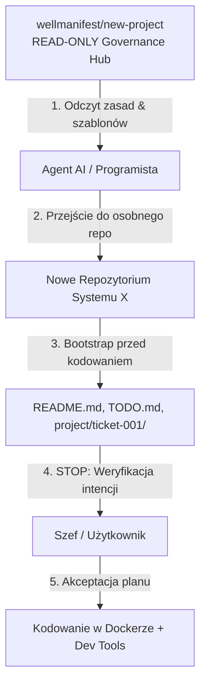

# 📊 Raport Wdrożeniowy: System Governance & Onboarding dla AI i Ludzi

[](#)
[](#)

> **Podsumowanie zarządcze:** Niniejszy raport podsumowuje nową architekturę współpracy z autonomicznymi agentami AI oraz ludźmi w naszej organizacji. Opisuje zasady działania systemu, przetestowane symulacje oraz mechanizmy weryfikacji intencji biznesowych przed rozpoczęciem prac programistycznych.

---

## 📌 1. Kluczowe Zasady i Architektura Systemu

Na podstawie analizy wymagań oraz dobrych praktyk rynkowych (Cursor, Claude Code, Antigravity) stworzyliśmy **Centrum Zasad i Onboardingu (Governance & Onboarding Hub)**.



### 🏆 4 Filarowe Zasady Organizacji:

1. **Bezwzględny Zakaz Śmiecenia w Hubie (`P-CORE-007`):**
   Repozytorium `wellmanifest/new-project` pełni funkcję wyłącznie **READ-ONLY Governance Hub**. Nie tworzy się w nim żadnych ticketów, logów ani plików zadań.
2. **Każdy Nowy System w Osobnym Repozytorium (`P-CORE-006`):**
   Dla każdego nowego projektu (np. System X, Kalkulator) powstaje **osobne, dedykowane repozytorium na GitHubie**, z obowiązkowym środowiskiem **Docker** (`Dockerfile`, `compose.yml`).
3. **Zasada „Dev Tools First” (Oszczędność Tokenów i Czasu):**
   Przed rozpoczęciem analizy kodu w docelowym repozytorium uruchamiane są skrypty automatyzujące `./project.sh` / `project.bat` (`code2llm`, `redup`, `prefact`, `doql`, `sumd`, `goal`, `vallm`). Agent pracujący na gotowych raportach w `./project/` oszczędza czas i tokeny.
4. **Wstrzymanie Pracy do Akceptacji Planu (`P-CORE-008`):**
   Agent **nie pisze kodu samowolnie**. Po zainicjowaniu planu w docelowym repozytorium wstrzymuje pracę i czeka na weryfikację i zgodę przełożonego.

---

## 🔍 2. Dwu-Elementowy Mechanizm Weryfikacji Intencji (Dual-View Review)

Zanim jakikolwiek kod zostanie napisany, Szef / Użytkownik otrzymuje w docelowym repozytorium **dwa widoki** do weryfikacji:

```
┌────────────────────────────────────────────────────────────────────────────────────────┐
│ 🧠 WIDOK 1: ZROZUMIENIE INTENCJI (project/ticket-001/README.md)                        │
│ -> Jak AI zrozumiało intencję i cel biznesowy Szefa                                    │
│ -> Zdefiniowane ryzyka i bezwzględne Kryteria Odbioru (Acceptance Criteria)           │
├────────────────────────────────────────────────────────────────────────────────────────┤
│ 📋 WIDOK 2: CHECKLISTA ZADAŃ (TODO.md w korzeniu repozytorium)                         │
│ -> Konkretna lista kroków (etapów realizacji), które AI zaplanowało wykonać            │
└────────────────────────────────────────────────────────────────────────────────────────┘
```

> **Wartość dla organizacji:** Junior lub nowy pracownik może skopiować te 2 widoki i przedstawić je Szefowi z pytaniem: *„Szefie, tak zrozumieliśmy zadanie i taki mamy plan. Czy to się zgadza?”*.

---

## 🧪 3. Przeprowadzone Symulacje i Wyniki Testów

W ramach weryfikacji systemu przeprowadziliśmy 4 symulacje na różnych poziomach doświadczenia:

### 👤 Symulacja 1: Senior Developer
* **Przebieg:** Senior wchodzi do repozytorium, odczytuje zasady z `POLICY.md`, widzi podział na osobne repozytoria oraz wymóg Dockera.
* **Wynik:** 100% jasności architektonicznej, zero pytań o granice odpowiedzialności.

### 👤 Symulacja 2: Mid-level Developer
* **Przebieg:** Mid czyta naturalny przewodnik w `README.md`, kopiuje szablony z `templates/`, zakłada ticket w docelowym repozytorium i wykonuje zadanie wg maszyny stanów z `CONTRIBUTING.md`.
* **Wynik:** Płynna praca krok po kroku bez pułapek.

### 👤 Symulacja 3: Junior / Stażysta (Pierwsza praca + Czat AI)
* **Przebieg:** Junior czuje się niepewnie i wkleja wytyczne z `AGENTS.md` / `README.md` do czatu AI.
* **Wynik:** AI natychmiast prowadzi Juniora za rękę – najpierw generuje opis zrozumienia intencji oraz listę `TODO.md`, nakazując wstrzymanie prac do momentu akceptacji przez Szefa.

### 🧮 Symulacja 4: Zadanie Rzeczywiste – „Kalkulator Liczb Pierwszych w Organizacji X”
* **Przebieg:**
  1. Agent odczytuje zasady z `wellmanifest/new-project` (nie tworzy tu żadnych plików).
  2. Przechodzi do repozytorium organizacji X (`/lokalizacja/organizacja/kalkulator-liczb-pierwszych`).
  3. Tworzy tam pliki planistyczne: `README.md`, `VERSION`, `CHANGELOG.md`, `TODO.md`, `project/ticket-001/README.md`, `Dockerfile`, `compose.yml`, `project.sh` / `project.bat`.
  4. **STOP:** Przedstawia Szefowi widok zrozumienia intencji oraz checklistę `TODO.md`.
  5. Po akceptacji: uruchamia skrypt Dev Tools, koduje kalkulator i przeprowadza testy w Dockerze.

---

## ✅ 4. Checklista Weryfikacji (Validation Checklist)

Wejdź i sprawdź, czy to, co miałeś w głowie, zostało wykonane poprawnie:

- [x] **Repozytorium Zarządcze (`wellmanifest/new-project`)**: Jest czyste (READ-ONLY Hub), nie zawiera żadnych tymczasowych ticketów ani logów.
- [x] **Zasada Osobnych Repozytoriów (`P-CORE-006`)**: Każdy nowy system powstaje w nowym repo na GitHubie.
- [x] **Środowisko Docker (`C-DOCKER-003`)**: Kod i testy uruchamiane są wyłącznie w odizolowanym Dockerze.
- [x] **Dev Tools (`P-TOOL-007`)**: Skrypty `project.sh` i `project.bat` automatyzują analitykę (`code2llm`, `redup`, `prefact`, `doql`, `sumd`, `goal`, `vallm`) i oszczędzają tokeny.
- [x] **Odbiór Planu (`P-CORE-008`)**: Agent zatrzymuje się po stworzeniu `project/ticket-001/README.md` oraz `TODO.md` i czeka na akceptację planu przed pisaniem kodu.

---

*Raport wygenerowany automatycznie przez Agenta AI i gotowy do wglądu.*
