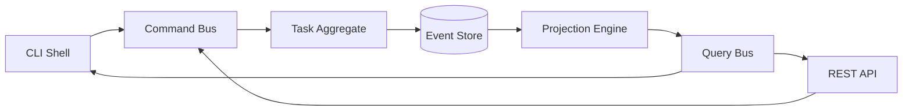

# Roadmap

This document is the living product roadmap for the Intent/Contract DSL Runtime. It lists what works today, what is planned, and how the system is exposed through a REST API and a shell CLI built on CQRS + Event Sourcing (CQRS+ES).

## 1. Current Capabilities

The repository is an offline MVP plus a standalone canonical model package.

- **Office DSL MVP (`office.dsl.v1`)**
  - Parser, structural validator, and human-readable token renderer.
  - Mock planner for selected single-message office commands.
  - TypeScript runtime with state machine, deterministic policy checks, `user.ask`, one-side confirmation, plan hashing, dry-run mock actions, file-backed task store, and audit records.
  - CLI (`packages/cli`) and backend API (`apps/backend`) for planning, validation, inspection, answers, confirmation, rejection, execution, and history.
  - Static web demo (`apps/web`).
  - Six example scenarios with deterministic example runner and Python verifier integration.

- **Canonical Intent/Contract model (`intent-contract.dsl.v1`)**
  - Standalone package `@office-dsl/intent-contract-model` with document, contract, party, role, intent, subject, obligation, deliverable, deadline, payment, condition, dependency, acceptance criteria, exclusion, assumption, risk, conflict, question, approval, source reference, render, and execution constructs.
  - Field statuses: `CONFIRMED`, `MISSING`, `INCOMPLETE`, `AMBIGUOUS`, `CONFLICTING`, `ASSUMED`, `REJECTED`, `NOT_APPLICABLE`.
  - Canonical serialization and stable SHA-256 hashing.
  - Diagnosis engine (`diagnoseIntentContractDsl`) for completeness gaps, ambiguity, conflict, assumption approval, traceability gaps, question routing, and `finalizationReady` gate.
  - `intent-contract.conversation.v1` input format with `Human1`, `Human2`, and `system` speakers, validation, parsing, and source-reference mapping.
  - Office DSL to Intent/Contract migration adapter (`officeDslToIntentContractDsl`).

- **Human1/Human2 negotiation examples (`examples-chat`)**
  - Four executable chat scenarios (short/long agreement, short/long cancellation).
  - Deterministic runner that processes `@user1`/`@user2` lines, maintains per-party and merged contract state, writes per-event diffs, and finalizes only after bilateral approval of the same merged hash.
  - Generated `*.dsl.hcl` project DSL artifacts and minimal PDF for verification.

- **Verification**
  - Root `verify` script running typecheck, lint, format check, TypeScript tests, Python tests, example runners, and `git diff --check`.
  - GitHub Actions workflow for Windows and Linux.

## 2. Target Architecture: CQRS + Event Sourcing

The runtime is split into a **command side** that validates and appends events, and a **query side** that projects read models from the event stream.



### 2.1 Aggregates and Events

The primary aggregate is the **Task Aggregate**. Its state is rebuilt by replaying events.

**Events:**

| Event | Meaning |
|-------|---------|
| `TaskCreated` | A new task was created from a natural language input or a DSL snapshot. |
| `DslGenerated` | A candidate DSL was attached to the task. |
| `ValidationCompleted` | Structural and policy validation finished with allowed transitions. |
| `QuestionAsked` | A missing or ambiguous field requires human input. |
| `AnswerProvided` | A human answered a question. |
| `ConfirmationRequired` | A high-risk action needs explicit confirmation. |
| `Confirmed` | A confirmation was accepted. |
| `IntentContractApproved` | Human1 or Human2 approved a canonical DSL hash. |
| `ApprovalInvalidated` | A previous approval was invalidated because the DSL changed. |
| `ClarificationReopened` | Human2 rejected a field and the question was routed back to Human1. |
| `TaskRejected` | The task was explicitly denied. |
| `TaskCancelled` | The task was cancelled. |
| `ExecutionStarted` | The runtime began executing the plan. |
| `ActionExecuted` | One plan action was executed. |
| `ExecutionSucceeded` | The plan finished successfully. |
| `ExecutionFailed` | The plan failed with an error. |
| `DslUpdated` | The canonical Intent/Contract DSL was replaced by a new validated snapshot. |
| `DocumentRendered` | A formal document was generated from an approved DSL. |
| `CodeGenerated` | Code and tests were generated from an approved DSL. |
| `VerifierCalled` | The Python verifier was invoked and its verdict appended. |

### 2.2 Commands

Commands are the only way to mutate state. Each command becomes zero or more events.

| Command | Handler |
|---------|---------|
| `CreateTask` | Create a task from NL or DSL. |
| `UpdateDsl` | Replace the canonical DSL snapshot, recompute hash, invalidate stale approvals. |
| `AnswerQuestion` | Provide an answer to a missing-field question. |
| `ConfirmAction` | Confirm a high-risk action or plan hash. |
| `ApproveIntentContract` | Human1 or Human2 approves the current canonical hash. |
| `RejectApproval` | Human2 rejects a field and reopens clarification. |
| `RejectTask` | Explicitly deny the task. |
| `CancelTask` | Cancel the task. |
| `ExecuteTask` | Run the approved plan, dry-run by default. |
| `RenderDocument` | Generate a legal/contract document from approved DSL. |
| `GenerateCode` | Generate JS/Node.js implementation and tests from approved DSL. |
| `RunVerifier` | Invoke the Python verifier on the current artifacts. |

### 2.3 Projections / Queries

| Query | Projection |
|-------|------------|
| `GetTask` | Current aggregate state. |
| `GetTaskAudit` | Immutable audit record. |
| `ListTasks` | List of task IDs and current states. |
| `GetTaskPlan` | Execution plan derived from the current DSL. |
| `GetQuestions` | Open questions with party routing. |
| `GetApprovals` | Active and invalidated approvals. |
| `GetConflicts` | Conflicting fields with source references. |
| `GetRenderedDocument` | Last rendered document for the task. |
| `GetGeneratedCode` | Last generated code/test artifacts. |

## 3. REST API (CQRS+ES)

The REST layer exposes commands as `POST` resources and queries as `GET` resources. All responses are JSON.

### 3.1 Commands

| Method | Path | Body | Description |
|--------|------|------|-------------|
| `POST` | `/api/tasks` | `{ input, mode?, dsl? }` | Create a task from natural language or a supplied DSL snapshot. |
| `POST` | `/api/tasks/{id}/dsl` | `{ dsl, reason }` | Replace the canonical Intent/Contract DSL and recompute hashes. |
| `POST` | `/api/tasks/{id}/answers` | `{ questionId, answer }` | Answer a clarification question. |
| `POST` | `/api/tasks/{id}/confirm` | `{ confirmationId, planHash }` | Confirm a high-risk action. |
| `POST` | `/api/tasks/{id}/approve` | `{ party, hash, decision? }` | Human1 or Human2 approves or rejects the current canonical DSL hash. |
| `POST` | `/api/tasks/{id}/reject-field` | `{ field, reason }` | Human2 rejects a field and reopens clarification to Human1. |
| `POST` | `/api/tasks/{id}/reject` | `{}` | Reject the whole task. |
| `POST` | `/api/tasks/{id}/cancel` | `{}` | Cancel the task. |
| `POST` | `/api/tasks/{id}/execute` | `{ execute? }` | Execute the plan, dry-run by default. |
| `POST` | `/api/tasks/{id}/render` | `{ format, template? }` | Render a document from approved DSL. |
| `POST` | `/api/tasks/{id}/generate` | `{ target }` | Generate code/tests from approved DSL. |
| `POST` | `/api/tasks/{id}/verify` | `{}` | Run the Python verifier on the current artifacts. |

### 3.2 Queries

| Method | Path | Description |
|--------|------|-------------|
| `GET` | `/api/tasks` | List all tasks. |
| `GET` | `/api/tasks/{id}` | Get current task state. |
| `GET` | `/api/tasks/{id}/audit` | Get immutable audit record. |
| `GET` | `/api/tasks/{id}/plan` | Get execution plan. |
| `GET` | `/api/tasks/{id}/questions` | Get open questions. |
| `GET` | `/api/tasks/{id}/approvals` | Get active and invalidated approvals. |
| `GET` | `/api/tasks/{id}/conflicts` | Get conflicting fields. |
| `GET` | `/api/actions` | List registered actions. |
| `GET` | `/api/connectors` | List mock connectors. |
| `GET` | `/openapi.json` | OpenAPI 3.1 descriptor. |

### 3.3 Event Stream

| Method | Path | Description |
|--------|------|-------------|
| `GET` | `/api/tasks/{id}/events` | Get the raw event stream for the task. |

## 4. CLI Shell (CQRS+ES)

The CLI shell is a REPL and a set of typed commands that send commands and queries to the same runtime. It is available as `corepack pnpm run cli:shell`.

### 4.1 REPL Commands

```text
> create "Przygotuj raport niezaplaconych faktur starszych niz 30 dni."
> inspect <taskId>
> plan <taskId>
> questions <taskId>
> answer <taskId> <questionId> <text>
> confirm <taskId> <confirmationId> [planHash]
> approve <taskId> Human1 [hash]
> reject-field <taskId> <field> "reason"
> reject <taskId>
> cancel <taskId>
> execute <taskId> [--execute]
> audit <taskId>
> list
> help
> exit
```

### 4.2 One-shot Commands

The same command bus is exposed as one-shot CLI commands for scripts and CI:

```bash
office-dsl task create "input" [--json]
office-dsl task get <id> [--json]
office-dsl task answer <id> <questionId> <answer> [--json]
office-dsl task confirm <id> <confirmationId> [planHash] [--json]
office-dsl task approve <id> --party Human1 [--hash <hash>] [--json]
office-dsl task reject-field <id> <field> --reason "..." [--json]
office-dsl task reject <id> [--json]
office-dsl task cancel <id> [--json]
office-dsl task execute <id> [--execute] [--json]
office-dsl task audit <id> [--json]
office-dsl task list [--json]
office-dsl task questions <id> [--json]
office-dsl task approvals <id> [--json]
office-dsl task conflicts <id> [--json]
office-dsl task events <id> [--json]
```

## 5. Planned Capabilities

### Phase A - Runtime CQRS+ES Foundation

- Replace direct `Runtime` state mutation with an event-sourced aggregate root (`TaskAggregate`) and append-only `EventStore`.
- Implement `CommandBus`, `QueryBus`, and projection handlers.
- Keep the existing file-backed store as an `EventStore` adapter while adding optional in-memory and database-backed stores.
- Add `TaskCreated`, `DslGenerated`, `ValidationCompleted`, `QuestionAsked`, `AnswerProvided`, `ConfirmationRequired`, `Confirmed`, `IntentContractApproved`, `ApprovalInvalidated`, `ClarificationReopened`, `TaskRejected`, `TaskCancelled`, `ExecutionStarted`, `ActionExecuted`, `ExecutionSucceeded`, `ExecutionFailed`, and `DslUpdated` events.
- Expose the event stream in the REST API and CLI.

### Phase B - REST API for CQRS+ES

- Implement `POST /api/tasks/{id}/dsl`, `/approve`, `/reject-field`, `/render`, `/generate`, and `/verify`.
- Implement query endpoints `/plan`, `/questions`, `/approvals`, `/conflicts`, and `/events`.
- Keep the existing `/api/tasks` endpoints backward compatible while migrating the response format to the CQRS projection.
- Update `openapi.json` to 3.1 and version `0.8.0`.

### Phase C - CLI Shell and One-shot Commands

- Add `packages/cli/src/shell.ts` REPL.
- Add one-shot `task` subcommands for every command and query.
- Add `--events` and `--audit` JSON output modes.
- Add tab completion and command history in the REPL.

### Phase D - Human1/Human2 Conversation Workflow in Runtime

- Wire `intent-contract.conversation.v1` input into `CreateTask` and `UpdateDsl` commands.
- Run `diagnoseIntentContractDsl` inside `ValidationCompleted` projection.
- Route questions to `Human1`, `Human2`, or both based on `targetParties`.
- Implement `RejectApproval` and `ClarificationReopened` events so Human2 can block finalization and trigger a question back to Human1.
- Finalize a contract only when `finalizationReady` is true and both parties approved the same current hash.

### Phase E - Renderers and Verifier Integration

- Add contract, service agreement, employment agreement, and task delegation renderers.
- Add document-to-DSL traceability maps.
- Integrate the Python verifier as a `RunVerifier` command gating `RenderDocument` and `GenerateCode`.
- Add test-generation DSL inputs (`REQUIREMENT`, `INVARIANT`, `ACCEPTANCE_CRITERIA`, etc.) and generate unit/integration/security test specifications.

### Phase F - Production Hardening

- Define canonical security policy for LLM, runtime, renderer, codegen, and verifier.
- Add full audit event schema, secret redaction, and authorization model.
- Replace local JSON event store with a production event store option.
- Add packaging/release policy and observability documentation.

## 6. Milestones

| Version | Goal |
|---------|------|
| `0.7.x` | Offline MVP, canonical model package, deterministic example runners, and chat negotiation regression fixtures. |
| `0.8.0` | CQRS+ES runtime foundation, new REST commands/queries, and CLI shell. |
| `0.9.0` | Full Human1/Human2 conversation workflow, conflict/assumption diagnosis in runtime, and bilateral approval finalization. |
| `0.10.0` | Contract/legal renderers, code generation, test generation, and Python verifier gating. |
| `1.0.0` | Production hardening, auth, observability, and packaged release. |

## 7. Relation To TODO.md

`TODO.md` tracks concrete, checkable tasks for the current pass. `ROADMAP.md` is the higher-level product and architecture plan. Items in `TODO.md` are derived from the phases above.
