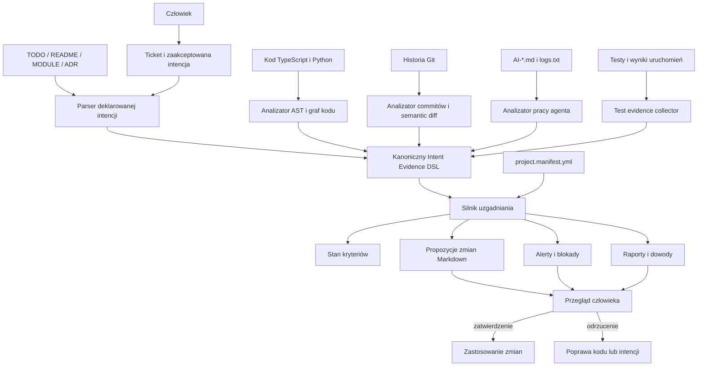
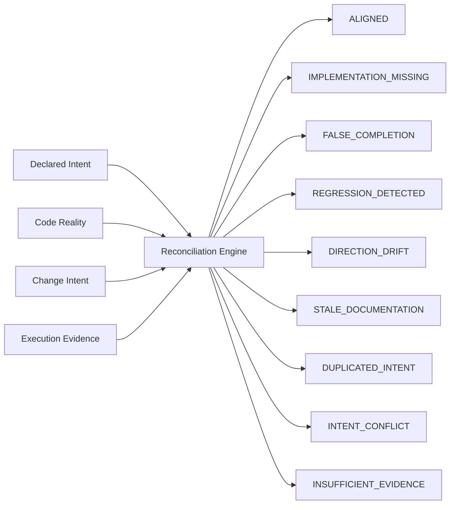
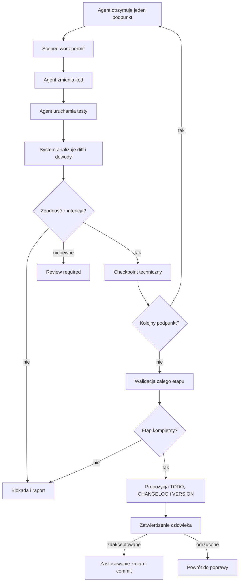

# System monitorowania zgodności intencji, kodu i dokumentacji

## 1. Cel dokumentu

Ten dokument opisuje docelowy system, którego zadaniem jest:

- kontrolowanie, czy agent realizuje zaakceptowany zakres ticketu i TODO;
- wykrywanie niepełnej, błędnej albo sprzecznej implementacji, nawet gdy wszystkie testy są zielone;
- porównywanie deklarowanej intencji z rzeczywistym stanem kodu;
- wykrywanie regresji, duplikacji, odejścia od kierunku projektu i nieaktualnej dokumentacji;
- automatyczne przygotowywanie aktualizacji plików Markdown;
- ograniczenie pracy ludzi i agentów AI;
- blokowanie przejścia do kolejnego etapu, aktualizacji wersji i changelogu, dopóki człowiek nie zatwierdzi wyniku.

Najważniejsza zasada systemu:

> Agent deklaruje wykonanie. System zbiera i porównuje dowody. Człowiek zatwierdza. Dopiero wtedy zmiana staje się oficjalnym stanem projektu.

System nie uznaje deklaracji agenta, zielonych testów ani zaznaczenia `[x]` w TODO za samodzielny dowód ukończenia zadania.

---

## 2. Problem, który rozwiązujemy

Obecny proces może wyglądać następująco:

1. Agent otrzymuje duży etap z `TODO.md`.
2. Sam interpretuje jego intencję.
3. Wprowadza wiele zmian.
4. Dodaje lub modyfikuje testy.
5. Wszystkie testy przechodzą.
6. Agent zaznacza TODO jako wykonane.
7. Aktualizuje `CHANGELOG.md` i `VERSION`.
8. Przechodzi do kolejnego etapu.

Problem pojawia się, gdy implementacja:

- jest zgodna z testami, ale niezgodna z intencją;
- realizuje tylko część wymagań;
- zmienia kolejność lub logikę przepływu;
- rozszerza zakres poza ticket;
- usuwa wcześniejszą funkcję;
- tworzy duplikację odpowiedzialności;
- opisuje w dokumentacji funkcję, która faktycznie nie działa;
- oznacza zadanie jako ukończone bez wystarczających dowodów.

Po kilku godzinach repozytorium może zawierać wiele wzajemnie sprzecznych zmian, a koszt analizy i naprawy znacznie rośnie.

Docelowy system ma wykrywać takie odchylenie po małym, logicznym fragmencie pracy, a nie dopiero po zakończeniu całego etapu.

---

## 3. Źródła prawdy i źródła dowodów

System korzysta z czterech głównych obszarów informacji.

### 3.1. Deklarowana intencja

Źródła:

- `project/ticket-{NNN}/README.md`;
- zaakceptowane kryteria akceptacji;
- `TODO.md`;
- `README.md`;
- `CONTRIBUTING.md`;
- `POLICY.md`;
- `project.manifest.yml`;
- `MODULE.md`;
- ADR i dokumenty architektury;
- polecenie człowieka przypisane do ticketu.

To źródło odpowiada na pytanie:

> Co powinno zostać wykonane?

### 3.2. Stan rzeczywisty kodu

Źródła:

- TypeScript AST i TypeChecker;
- Python AST;
- graf importów;
- graf wywołań;
- eksportowane symbole;
- schematy danych;
- konfiguracje pakietów;
- testy i ich powiązanie z modułami;
- wynik uruchomienia aplikacji;
- struktura workspace.

To źródło odpowiada na pytanie:

> Co faktycznie istnieje i jak działa?

### 3.3. Historia zmian

Źródła:

- ostatnie commity zmieniające kod;
- diff na poziomie AST;
- tytuły i opisy commitów;
- zmienione symbole;
- usunięte lub dodane testy;
- historia zmian modułów;
- wcześniejsze wersje intencji;
- powiązania commitów z ticketami.

To źródło odpowiada na pytanie:

> W jakim kierunku projekt był zmieniany i co autor deklarował?

### 3.4. Historia działania agenta

Źródła:

- `project/ticket-{NNN}/AI-{NAME}.md`;
- `project/ticket-{NNN}/logs.txt`;
- deklaracje wykonania;
- wykonane komendy;
- wyniki testów;
- zmienione checkboxy;
- proponowane zmiany dokumentacji;
- lista commitów;
- zgłoszone blokery.

To źródło odpowiada na pytanie:

> Co agent twierdzi, że zrobił, i jakie dowody przedstawił?

---

## 4. Hierarchia wiarygodności

Nie każde źródło jest równoważne.

Proponowana hierarchia:

1. zaakceptowane polecenie człowieka i ticket;
2. zaakceptowane kryteria akceptacji;
3. manifest architektury i zatwierdzone ADR;
4. rzeczywisty kod oraz deterministyczne wyniki testów;
5. historia Git i diff;
6. TODO oraz dokumentacja stanu projektu;
7. raport agenta;
8. opis commita;
9. komentarze i nazwy symboli;
10. wniosek LLM.

Historia Git może pomóc odtworzyć intencję, ale nie może samodzielnie zmienić zaakceptowanego celu ticketu.

Kod może pokazać stan rzeczywisty, ale nie zawsze pokazuje, dlaczego dana decyzja została podjęta.

LLM może formułować hipotezy, lecz każda hipoteza musi zawierać poziom pewności i wskazanie dowodów.

---

## 5. Kanoniczny DSL dowodów i intencji

System nie powinien utrzymywać kilku niezależnych, nieporównywalnych DSL-i.

Powinien istnieć jeden kanoniczny **Intent Evidence DSL**, do którego normalizowane są informacje z kodu, Git, ticketów i historii agenta.

Przykład intencji pochodzącej z ticketu:

```yaml
statement:
  id: INT-014-AC-04
  subject: runtime.execution
  predicate: requires_before
  object: contract.validation

source:
  type: ticket
  path: project/ticket-014/README.md
  criterion: AC-04

epistemic:
  class: declaration
  confidence: 1.0

approval:
  human: approved
```

Przykład dowodu pochodzącego z kodu:

```yaml
statement:
  subject: runtime.execution
  predicate: calls_before
  object: contract.validation

source:
  type: code
  path: packages/dsl-runtime/src/executor.ts
  symbol: executeContract
  revision: abc123

epistemic:
  class: fact
  confidence: 1.0

observed:
  value: false
```

Przykład wniosku z historii commitów:

```yaml
statement:
  subject: commit:def456
  predicate: intends
  object: contract.validation

source:
  type: git
  revision: def456

epistemic:
  class: inference
  confidence: 0.78

evidence:
  - commit_message
  - changed_symbols
  - added_test
```

---

## 6. Ogólna architektura systemu



---

## 7. Cztery modele systemu

### 7.1. Code Reality Model

Opisuje rzeczywistą strukturę i zachowanie kodu.

Zawiera między innymi:

- pakiety i moduły;
- pliki;
- symbole;
- importy i eksporty;
- publiczne API;
- graf zależności;
- graf wywołań;
- relacje między testami a kodem;
- schematy danych;
- kolejność istotnych wywołań;
- hashe symboli i modułów.

AST nie jest traktowane jako intencja. AST jest źródłem faktów.

### 7.2. Change Intent Model

Opisuje intencję i kierunek zmian na podstawie historii Git.

System analizuje:

- trzy ostatnie commity zmieniające kod — szczegółowo;
- dziesięć ostatnich istotnych zmian — jako kontekst kierunku projektu.

Do trzech commitów szczegółowych nie są liczone:

- commity wyłącznie dokumentacyjne;
- zmiany formatowania;
- merge-only;
- wygenerowane artefakty;
- zmiany cache lub buildów.

Dla ostatnich trzech commitów wykonywany jest semantic diff:

```text
AST przed zmianą
→ AST po zmianie
→ zmienione symbole
→ zmienione zależności
→ zmienione ścieżki wywołań
→ dodane i usunięte testy
```

Dziesięć ostatnich zmian służy do wykrywania:

- kierunku projektu;
- powtarzających się prób rozwiązania tego samego problemu;
- cofania wcześniejszych decyzji;
- narastającego sprzężenia;
- stałego rozszerzania zakresu;
- zmiany odpowiedzialności modułów.

### 7.3. Declared Intent Model

Opisuje obowiązujący cel.

Głównym źródłem jest ticket:

```text
project/ticket-{NNN}/README.md
```

Ticket powinien zawierać:

- cel;
- zakres;
- elementy poza zakresem;
- ryzyka;
- kryteria akceptacji;
- status;
- powiązania z TODO;
- wymagane dowody;
- zatwierdzenie człowieka.

### 7.4. Execution Evidence Model

Opisuje pracę wykonaną przez agenta.

Zawiera:

- deklarowany status;
- zmienione pliki;
- zmienione symbole;
- wykonane komendy;
- wyniki testów;
- commity;
- zgłoszone problemy;
- dowody przypisane do kryteriów akceptacji;
- proponowane aktualizacje dokumentacji.

Agent może ustawić:

```text
agent_status = COMPLETED
```

Nie może sam ustawić:

```text
effective_status = DONE
```

---

## 8. Silnik uzgadniania

Silnik porównuje wszystkie modele i klasyfikuje wynik.



### Klasy problemów

| Kod | Znaczenie |
|---|---|
| `ALIGNED` | Intencja, kod, testy i deklaracja agenta są zgodne |
| `IMPLEMENTATION_MISSING` | Wymaganie nie ma wystarczającej implementacji |
| `FALSE_COMPLETION` | Agent oznaczył zadanie jako wykonane, ale dowody temu przeczą |
| `REGRESSION_DETECTED` | Wcześniej potwierdzona zdolność zniknęła lub została złamana |
| `DIRECTION_DRIFT` | Zmiany oddalają projekt od zaakceptowanego celu |
| `STALE_DOCUMENTATION` | Dokumentacja opisuje stan niezgodny z kodem |
| `UNDOCUMENTED_IMPLEMENTATION` | W kodzie pojawiła się nieplanowana zdolność |
| `DUPLICATED_INTENT` | Ten sam cel jest realizowany w kilku miejscach |
| `INTENT_CONFLICT` | Dwa zaakceptowane źródła deklarują sprzeczne cele |
| `AMBIGUOUS_REQUIREMENT` | Wymaganie jest za mało precyzyjne |
| `INSUFFICIENT_EVIDENCE` | System nie może wiarygodnie potwierdzić wykonania |

---

## 9. Wykrywanie niepełnej intencji

System może wykrywać trzy poziomy niekompletności.

### 9.1. Niekompletność składniowa

Przykład:

```text
System powinien sprawdzać, czy
```

Możliwe sygnały:

- urwany spójnik;
- otwarty nawias;
- niedomknięty blok;
- brak dopełnienia;
- przerwany punkt listy.

### 9.2. Niekompletność semantyczna

Przykład:

```text
Dodać walidację użytkownika.
```

Zdanie jest poprawne gramatycznie, ale brakuje:

- momentu walidacji;
- kryteriów;
- oczekiwanego wyniku;
- reakcji na błąd;
- dowodu wykonania.

DSL może ujawnić brakujące pola:

```yaml
intent:
  actor: null
  action: validate
  object: user
  trigger: null
  rules: null
  expected_outcome: null
  failure_behavior: null
```

Wynik:

```text
AMBIGUOUS_REQUIREMENT
Missing: trigger, rules, expected_outcome, failure_behavior
```

### 9.3. Niekompletność projektowa

Przykład:

```text
Dodać trzeci DSL.
```

Bez kontekstu nie wiadomo:

- jakie ma wejście;
- jakie ma wyjście;
- jak łączy się z innymi modelami;
- kto jest właścicielem;
- jak będzie testowany.

System nie powinien sam uzupełniać takiej intencji jako faktu. Powinien przygotować pytania do człowieka.

---

## 10. Model pracy agenta

Agent pracuje w kontrolowanym cyklu.



### Agent może

- edytować kod w zaakceptowanym zakresie;
- dodawać testy;
- uruchamiać testy;
- aktualizować swój plik `AI-{NAME}.md`;
- dopisywać surowe logi do `logs.txt`;
- deklarować, że podpunkt jest gotowy;
- przygotowywać propozycje dokumentacji.

### Agent nie może samodzielnie

- nadać końcowego statusu `DONE`;
- zatwierdzić kryterium akceptacji;
- zakończyć całego etapu;
- zaktualizować obowiązującego `VERSION`;
- zatwierdzić wpisu w `CHANGELOG.md`;
- zmienić zakres ticketu;
- zmienić zatwierdzonej intencji;
- przejść do kolejnego etapu po blokującym konflikcie;
- wysłać zmian na chronioną gałąź bez bramki.

---

## 11. Checkpointy i ograniczenie sześciogodzinnego dryfu

Duży etap TODO musi być dzielony na mniejsze punkty.

Przykład:

```text
Etap 4
├── 4.1 Model danych
├── 4.2 Parser
├── 4.3 Walidacja
├── 4.4 Integracja runtime
├── 4.5 Testy regresyjne
├── 4.6 Dokumentacja
└── 4.7 Wersja i changelog
```

Po każdym podpunkcie:

```text
implementacja
→ testy
→ semantic diff
→ porównanie z intencją
→ checkpoint
```

System może wymuszać checkpoint po przekroczeniu limitu:

```yaml
checkpointPolicy:
  maxFilesChanged: 15
  maxSemanticChanges: 25
  maxCommitsWithoutReview: 2
  maxTodoItemsWithoutValidation: 1
```

Limity nie oznaczają automatycznego błędu. Oznaczają konieczność ponownej walidacji zakresu.

---

## 12. Zielone testy a zgodność z intencją

System rozdziela trzy niezależne statusy:

```yaml
tests:
  status: PASSED

intentAlignment:
  status: FAILED

completion:
  status: BLOCKED
```

Możliwa sytuacja:

- wszystkie testy przechodzą;
- agent dodał test do nowej funkcji;
- funkcja działa;
- funkcja została jednak podłączona w złej kolejności;
- zaakceptowana logika wymaga walidacji przed wykonaniem;
- kod wykonuje walidację po wykonaniu.

Wynik:

```text
TEST_STATUS = PASSED
INTENT_STATUS = FAILED
EFFECTIVE_STATUS = BLOCKED
```

Zielone testy są jednym z dowodów, ale nie są dowodem zgodności semantycznej z ticketem.

---

## 13. Blokowanie agenta

### 13.1. Osobny branch lub worktree

Agent powinien pracować poza chronionym stanem projektu:

```text
main
└── agent/ticket-014-stage-4
```

albo:

```text
.worktrees/
└── ticket-014-agent/
```

Wykrycie konfliktu nie niszczy zmian. Branch zostaje zachowany do analizy.

### 13.2. Zakres dozwolonych ścieżek

Przed rozpoczęciem podpunktu system tworzy pozwolenie:

```yaml
workPermit:
  ticket: ticket-014
  criterion: AC-04

  allowedPaths:
    - packages/dsl-runtime/**
    - tests/runtime/**
    - project/ticket-014/AI-Codex.md
    - project/ticket-014/logs.txt

  protectedPaths:
    - TODO.md
    - CHANGELOG.md
    - VERSION
    - project/ticket-014/README.md
    - docs/ARCHITECTURE.md
    - project.manifest.yml
```

Zmiana poza zakresem powoduje:

- ostrzeżenie;
- wymaganie rozszerzenia zakresu;
- albo blokadę, zależnie od ryzyka.

### 13.3. Poziomy reakcji

| Poziom | Przykład | Reakcja |
|---|---|---|
| `INFO` | duży plik lub rosnący hotspot | agent pracuje dalej |
| `WARNING` | brak aktualizacji generowanej sekcji | agent kończy podpunkt, nie kończy etapu |
| `REVIEW_REQUIRED` | nowa zależność poza manifestem | zatrzymanie przed następnym podpunktem |
| `BLOCKING` | implementacja sprzeczna z ticketem | natychmiastowe zatrzymanie |
| `CRITICAL` | sekret, utrata danych, niezatwierdzone breaking API | blokada zapisu i publikacji |

---

## 14. Chronione pliki

Następujące pliki są częścią zatwierdzonego stanu projektu:

```text
TODO.md
CHANGELOG.md
VERSION
README.md
docs/PROJECT_MAP.md
docs/ARCHITECTURE.md
packages/*/MODULE.md
project.manifest.yml
project/ticket-*/README.md
```

Agent może przygotować ich zmianę, ale nie powinien sam uznawać jej za zatwierdzoną.

Propozycje trafiają do:

```text
.ai/proposals/
├── TODO.patch
├── CHANGELOG.patch
├── VERSION.patch
├── PROJECT_MAP.patch
├── MODULES.patch
└── ticket-status.patch
```

Dopiero człowiek może:

- zaakceptować;
- odrzucić;
- zmodyfikować;
- skierować do ponownej pracy.

---

## 15. Automatyczna aktualizacja Markdown

Celem systemu jest zmniejszenie ilości ręcznej pracy.

### 15.1. Automatycznie generowane fakty

System może generować:

- listę modułów;
- publiczne API;
- zależności;
- testy modułu;
- zmienione symbole;
- graf architektury;
- status kryteriów;
- dowody wykonania;
- największe pliki;
- hotspoty;
- wykryte regresje;
- listę commitów;
- wyniki walidacji;
- proponowany wpis changelogu;
- proponowaną zmianę wersji.

### 15.2. Treści wymagające decyzji człowieka

System nie powinien sam zatwierdzać:

- celu biznesowego;
- zmiany kierunku;
- decyzji architektonicznej;
- zmiany zakresu;
- uzasadnienia;
- priorytetu;
- wyjątku od reguły;
- końcowego statusu `DONE`.

### 15.3. Sekcje generowane

Przykład `MODULE.md`:

```markdown
# dsl-runtime

## Odpowiedzialność

Zarządza kontrolowanym wykonaniem zatwierdzonego kontraktu.

## Poza zakresem

Nie interpretuje bezpośrednio języka naturalnego.

<!-- AUTO:PUBLIC_API:START -->

## Publiczne API

- `executeContract`
- `approveContract`
- `cancelContract`

<!-- AUTO:PUBLIC_API:END -->

<!-- AUTO:DEPENDENCIES:START -->

## Zależności rzeczywiste

- `@office-dsl/intent-contract-model`
- `@office-dsl/verifier-bridge`

<!-- AUTO:DEPENDENCIES:END -->

<!-- AUTO:TESTS:START -->

## Powiązane testy

- `tests/runtime/executor.test.ts`

<!-- AUTO:TESTS:END -->
```

System automatycznie odświeża sekcje ujęte w komentarze `<!-- AUTO:... -->`.

---

## 16. Struktura artefaktów systemu

Do obsługi silnika rekomenduje się wprowadzenie poniższej struktury:

```text
.intent/
├── manifest.yml
├── rules/
│   ├── policy.yml
│   └── architecture.yml
├── state/
│   ├── intent.graph.json
│   ├── code.graph.json
│   └── reconciliation.json
└── proposals/
    ├── TODO.patch
    ├── CHANGELOG.patch
    └── VERSION.patch
```

Pliki `.intent/` mogą być budowane automatycznie w CI lub podczas lokalnej walidacji.

---

## 17. Scenariusz wykrywania błędu w praktyce

1. Agent edytuje moduł walidacji.
2. Zmienia warunek tak, że błędny kontrakt nie zgłasza błędu.
3. Agent modyfikuje test, aby dopasować go do swojego błędu.
4. Uruchamia testy — wynik: `PASSED`.
5. Agent próbuje zaznaczyć zadanie jako wykonane.
6. Silnik uzgadniania analizuje semantic diff oraz deklarowaną intencję z `project/ticket-014/README.md`.
7. Silnik wykrywa, że kryterium `AC-02` (wymóg zgłaszania wyjątku przy braku podpisu) przestało być spełnione.
8. Wynik walidacji:

```yaml
result: BLOCKED
issueClass: FALSE_COMPLETION
brokenCriterion: AC-02
reason: "Code no longer validates signature presence before execution"
suggestedAction: "Revert changes in packages/dsl-runtime/src/executor.ts:L45-L52"
```

9. Zmiana zostaje zablokowana. Człowiek otrzymuje powiadomienie o przerwaniu cyklu.

---

## 18. Korzyści dla projektu i zespołu

- **Ochrona kierunku projektu:** Zapobiega cichemu zniekształcaniu celu przez agenty AI.
- **Redukcja czasu review:** Człowiek weryfikuje zwięzłe podsumowania i raporty zamiast całego kodu.
- **Zero nieaktualnej dokumentacji:** Sekcje faktograficzne odświeżają się automatycznie.
- **Wczesne wykrywanie regresji:** Wykrywa błędy od razu po podpunkcie, a nie po całym tygodniu prac.
- **Jednoznaczne dowody:** Odbiór zadania bazuje na faktach z kodu i AST, a nie obietnicach agenta.

---

## 19. Wnioski i zalecenia wdrożeniowe

1. **Wprowadzić ścisłe rozróżnienie:** Agent deklaruje wykonanie, system generuje dowody, człowiek zatwierdza.
2. **Wdrożyć zabronione ścieżki:** Zablokować agentom bezpośrednią edycję `TODO.md`, `CHANGELOG.md` i `VERSION` do czasu zatwierdzenia przez człowieka.
3. **Wprowadzić mikrostany w ticketach:** Dzielić etapy na mniejsze zadania z automatycznym checkpointem.
4. **Zastosować generowanie sekcji w Markdown:** Zautomatyzować utrzymanie dokumentacji API i zależności w plikach `.md`.
