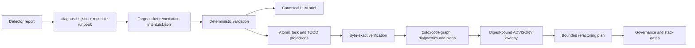

# Diagnostic remediation intent DSL

The remediation intent DSL turns concrete diagnostic findings into a bounded,
machine-checkable refactoring request. It does not replace policy, a ticket, or
trusted approval. It prevents an LLM or todo2code plan from silently inventing
scope, applicability, evidence, ownership, or destructive authority.



## Where each kind of solution belongs

| Content | Canonical location | Lifetime |
|---|---|---|
| Stable code, message and shortest safe remediation | `governance/diagnostics.json` | Reusable standard |
| Multi-step or risky reusable procedure | `error/*.md` | Reusable runbook |
| Concrete report, evidence, scope and refactoring DAG | `project/ticket-{NNN}/remediation-intent.dsl.json` in the target repository | One incident/workstream |
| LLM/todo2code hints | `advisoryAnalysis` in that target-owned intent | Digest-bound advisory evidence |

Therefore `error/*.md` defines reusable resolution procedure, not the current
incident. Reports, target tickets, logs and populated remediation intents must
never be copied into `wellmanifest/new-project`.

## Contract

The JSON representation uses schema `new-project.remediation-intent/v1` and is
validated by `governance/remediation-intent.schema.json` plus semantic checks in
`scripts/remediation_intent.py`. The template is
`template/files/remediation-intent.template.dsl.json`.

Each active finding records a stable detector code, evidence references,
positive applicability signals, excluded signals, the required diagnostic
transition, affected paths and acceptance criteria. Actions form an acyclic
dependency graph, stay inside `scope.allowedPaths`, name deterministic
verification, and explicitly classify destructive or user-state risk.
`ownerRoute` identifies the accountable participant; an explicit
`unresolved:human` or `unresolved:agent` route is valid only while the intent is
`DRAFT`, never as an invented identity in a ready execution contract.

`FALSE_POSITIVE` requires both positive and excluded signals. This separates a
real OpenRouter client (runtime import/call/configuration) from detector source,
documentation, fixtures or tests that merely mention `OPENROUTER_*`.
`SILENT_OMISSION` and `MISSING_INVENTORY` require a `MISSING -> EMIT`
transition, so an unreadable selected path or absent expected repository cannot
disappear silently. `AMBIGUOUS_HEURISTIC` captures cases such as uncertain
fleet/organization layout and should lead to an explicit contract or a blocked
`auto` decision. `STATE_RISK` requires preservation and prohibits automation;
dirty worktrees are never cleaned by inference.

Release actions must depend transitively on every active P0/P1 repair. This
allows an intent to say that a package version, tag or release is stale while
still preventing publication before correctness work.

## Commands

Run these from a repository that adopted the governed assets:

```bash
python3 .governance/remediation_intent.py validate project/ticket-123/remediation-intent.dsl.json
python3 .governance/remediation_intent.py render-llm project/ticket-123/remediation-intent.dsl.json --out project/ticket-123/remediation-brief.md
python3 .governance/remediation_intent.py render-todo2code project/ticket-123/remediation-intent.dsl.json --root .
python3 .governance/remediation_intent.py verify-todo2code project/ticket-123/remediation-intent.dsl.json --root .
```

`render-todo2code` writes atomically to `todo2code.taskPath` and
`todo2code.todoPath` from the accepted intent. Supplying both legacy
`--task-out` and `--todo-out` remains available for an explicit external
projection. `verify-todo2code` is the required gate for target-owned declared
paths: a missing file, byte drift or symlink/path escape emits
`GOV-REMEDIATION-004`.

The task and TODO contain the same canonical action sentence. All authority
metadata, outcome, constraints, non-goals and LLM guardrails are Markdown
headings, which the todo2code NL extractor ignores as records. Each action is
one physical sentence with a conventional action prefix, finding IDs/codes and
priority, exact paths, dependencies, acceptance criteria, verification command
and expected result, plus risk/authorization. Thus one DSL action cannot turn
into several anonymous requirements.

After todo2code has deterministically produced `t2c.diagnostics/v1` and
`t2c.code-change-plan-set/v1` artifacts:

```bash
python3 .governance/remediation_intent.py analyze-todo2code \
  project/ticket-123/remediation-intent.dsl.json \
  --graph path/to/intent.graph.json \
  --diagnostics path/to/diagnostics.json \
  --plans path/to/code-change-plans.json \
  --out project/ticket-123/remediation-intent.analyzed.dsl.json
```

The analyzer first selects graph records whose `source.path` is the declared
task or TODO projection. It then considers only diagnostics whose `recordIds`
and plans whose `evidence.recordIds` cite that set. Unrelated historical plans
remain in the digest-bound input artifacts but cannot expand or block this
incident. Relevant scope expansion, unauthorized deletion, missing finding or
acceptance coverage, lowered priority, ambiguity and human/agent conflicts are
still reported. The overlay has `authority: ADVISORY` and binds the
authority-bearing intent, graph, diagnostics, plans and correlated record IDs.
Any input edit requires re-analysis.

`todo2code.requiredDiagnosticCodes` is a fail-closed capability declaration.
Version 1 requires todo2code ambiguity, planned-not-implemented and both
human/agent conflict codes; omitting or inventing a code invalidates the DSL
instead of silently disabling an inconsistency check.

## LLM planning rule

Give the LLM only a validated canonical brief. The LLM plans in declared DAG
order, preserves non-goals and user state, cites finding/action/criterion IDs,
and turns unknowns into questions. It may refine implementation details inside
accepted paths. It may not infer an owner, suppress an uncertain finding,
delete user state, expand scope, or treat todo2code output as approval.
