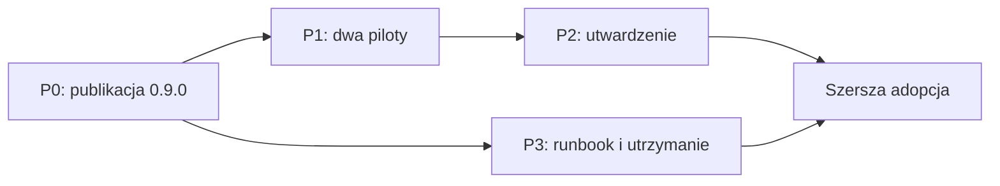

# Dalszy plan po 0.9.0

Status: aktywna roadmapa  
Stan bazowy: 2026-08-04  
Właściciel standardu: `wellmanifest/new-project`

## 1. Stan obecny

Implementacja 0.9.0 jest gotowa lokalnie. Obejmuje zwalnianie rezerwacji przez
statusy nieaktywne, fail-closed dla nieznanych statusów, jawnie zaufanych
reviewerów, kontrakt opublikowanego locka oraz deterministyczny generator
adopcji z pełnego SHA commita.

Lokalnie przechodzą trzy zestawy regresyjne:

- `tests/governance-scripts.test.sh`;
- `tests/governance-validator.test.sh`;
- `tests/adoption-lock.test.sh`.

Wersja nie jest jeszcze opublikowanym wydaniem. Zmiany 0.9.0 są w worktree,
bieżący HEAD nie ma tagu, a zatem nie istnieje jeszcze finalny pełny SHA, który
repozytoria docelowe mogą bezpiecznie wpisać do locka.

## 2. Co pozostało

### P0 — domknięcie i publikacja 0.9.0

1. Przejrzeć cały diff 0.9.0, ze szczególnym uwzględnieniem listy plików
   zarządzanych przez `create_adoption_lock.py`, semantyki statusów i granicy
   `trusted-reviewers`.
2. Otworzyć PR i uruchomić wymagany workflow GitHub na aktualnym HEAD.
3. Skonfigurować chronioną listę zaufanych reviewerów oraz Ruleset/CODEOWNERS;
   reviewer zatwierdzający nie może być autorem zmian.
4. Po zielonym CI i zaufanym review scalić PR, utworzyć tag `v0.9.0` i wskazać
   pełny 40-znakowy SHA opublikowanego commita.
5. Z czystego checkoutu tagu ponownie uruchomić trzy zestawy testów i zachować
   wynik jako dowód wydania.

Kryterium zakończenia: tag `v0.9.0` wskazuje commit z zielonym wymaganym CI, a
generator potrafi utworzyć lock wskazujący dokładnie ten commit.

### P1 — kontrolowany pilotaż adopcji

1. Wybrać dwa repozytoria pilotażowe: jedno z pojedynczym workstreamem i jedno
   z równoległą pracą wielu agentów.
2. Uruchomić `create_adoption_lock.py` z SHA wydania, przejrzeć zachowany
   manifest docelowy i dodać caller reusable workflow.
3. W każdym pilocie przeprowadzić scenariusz pozytywny oraz próby regresji:
   aktywny konflikt, nieznany status, approval spoza trusted reviewers, drift
   pliku zarządzanego i zmiana poza dozwolonym zakresem.
4. Potwierdzić, że `BACKLOG`, `PLAN` i `BLOCKED` zachowują dowody, ale nie
   blokują nowego `IN_PROGRESS` w tym samym workstreamie.
5. Zapisać wynik, czas obsługi i potrzebne odstępstwa. Problem wspólny dla obu
   pilotów wraca do standardu; konfiguracja lokalna pozostaje w manifeście
   repozytorium docelowego.

Kryterium zakończenia: oba repozytoria przechodzą ścieżkę pozytywną i odrzucają
wszystkie scenariusze negatywne bez ręcznego obchodzenia gate'a.

### P2 — utwardzenie narzędzi i CI

1. Dodać do generatora tryb `--check` lub `--dry-run`, który pokazuje drift i
   plan upgrade bez zapisu. Lokalnie zaimplementowano `--check` oraz integrację
   `goal governance adopt`; wymagają one publikacji i dowodu CI przed uznaniem
   punktu za zakończony.
2. Zastąpić ręcznie utrzymywaną mapę zarządzanych plików wersjonowanym
   manifestem pakietu albo testem wymuszającym jej kompletność.
3. Rozszerzyć CI o meta-walidację Draft 2020-12 i walidację przykładowych
   manifestów/locków względem schematów, nie tylko kontrolę składni JSON.
4. Dodać Windows CI dla wrapperów `.bat` i generatora Python; obecne fixture'y
   wykonawcze pokrywają środowisko Linux.
5. Dodać fixture upgrade między dwiema rzeczywistymi wersjami standardu,
   obejmujący zachowanie lokalnego manifestu i czytelny raport konfliktów.

Kryterium zakończenia: drift można ocenić bez modyfikacji plików, lista pakietu
nie może rozjechać się po dodaniu artefaktu, a Linux i Windows mają wymagane CI.

### P3 — eksploatacja i utrzymanie

1. Zastąpić historyczny raport do 0.5.0 bieżącym raportem operacyjnym albo
   przenieść go jawnie do dokumentacji archiwalnej.
2. Opisać procedurę upgrade, rollback do poprzedniego pełnego SHA oraz reakcję
   na kompromitację zaufanego reviewera lub opublikowanej rewizji.
3. Ustalić cykliczny przegląd diagnostyk, statusów i listy reviewerów oraz
   właściciela decyzji o kolejnym wydaniu.
4. Po pilotażu usunąć nieużywane reguły i uprościć kroki, które nie wykazały
   wartości w dowodach adopcyjnych.

Kryterium zakończenia: operator ma aktualny runbook publikacji, upgrade i
rollback, a standard ma wskazanego właściciela oraz termin przeglądu.

## 3. Kolejność wykonania

P0 jest blokadą dla wszystkich adopcji, ponieważ dopiero publikacja tworzy
wiarygodny `sourceRevision`. P1 musi poprzedzić rozszerzanie standardu o nowe
mechanizmy. P2 powinno wynikać z wyników pilotów; wyjątkiem są niezależne prace
nad meta-walidacją schematów i Windows CI. P3 może rozpocząć się równolegle po
publikacji, ale runbook rollback musi być gotowy przed adopcją produkcyjną.

## 4. Definicja gotowości do szerszej adopcji

Standard jest gotowy do szerszego wdrożenia dopiero wtedy, gdy:

- wydanie ma tag, immutable SHA, zielone CI i zaufane current-head review;
- dwa różne piloty dostarczyły pozytywne i negatywne dowody działania;
- upgrade i rollback są udokumentowane i przećwiczone;
- drift można sprawdzić bez zapisu;
- wymagane kontrole działają na wspieranych systemach operacyjnych;
- znany właściciel standardu zatwierdził wyniki pilotów.

Do tego momentu 0.9.0 należy traktować jako release candidate do kontrolowanej
adopcji, a nie jako automatyczny standard dla wszystkich repozytoriów.
