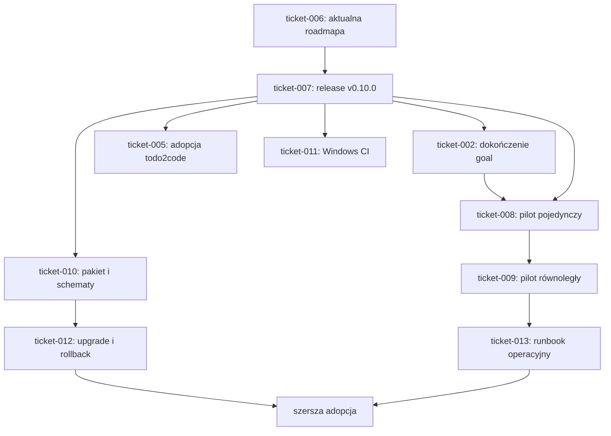

# Roadmapa po integracji 0.10.0

Status: aktywna roadmapa  
Stan bazowy: 2026-08-04  
Właściciel standardu: `wellmanifest/new-project`

Nazwa pliku pozostaje zgodna z istniejącymi odnośnikami, ale dokument opisuje
stan po integracji wersji `0.10.0`.

## 1. Zweryfikowany stan

Na chronionej gałęzi `main` znajduje się kontrakt `0.10.0`, obejmujący:

- lifecycle, w którym tylko `IN_PROGRESS` rezerwuje workstream i zakres;
- bounded delivery z klasami `XS|S`, limitem 30 minut i budżetem plików;
- immutable adoption lock generowany z pełnego SHA;
- allowlistowane approval człowieka, Validator GitHub App lub podpisaną
  atestację;
- fail-closed walidację zewnętrznego approval evidence bez podążania za
  symlinkiem;
- advisory review przez `openrouter/z-ai/glm-5.2`, które nie jest trust root.

PR-y #1-#5 zostały scalone. PR #5 przeniósł ticket 005 do `BLOCKED`, ponieważ
jego implementacja jest gotowa, lecz pełne kryterium wymaga jeszcze publikacji
immutable wydania i adopcji w repozytorium zależnym.

Nie istnieje jeszcze tag `v0.10.0` ani odpowiadający mu GitHub Release. Sam
commit na `main` nie jest finalnym `sourceRevision` dla produkcyjnej adopcji.

## 2. Status istniejących ticketów

| Ticket | Stan | Znaczenie |
| :--- | :--- | :--- |
| `ticket-001` | DONE | Hub jest edytowalnym źródłem standardu w granicach ticketu. |
| `ticket-002` | BLOCKED | Integracja `goal` jest zaimplementowana, ale czeka na opublikowany pełny SHA. |
| `ticket-003` | DONE | Zaufane approval Validator App i signed attestation są wdrożone. |
| `ticket-004` | DONE | Kanoniczny kontrakt 0.10.0 został scalony. |
| `ticket-005` | BLOCKED | Uszczelnienie evidence jest scalone; czeka na release i adopcję `todo2code`. |
| `ticket-006` | IN_PROGRESS | Synchronizacja roadmapy i kolejki dalszych prac. |

`BLOCKED` zachowuje plan i dowody, lecz nie rezerwuje workstreamu ani ścieżek.

## 3. Pozostałe prace

### P0 — aktualna dokumentacja (`ticket-006`)

Uzgodnić tę roadmapę, `TODO.md` i indeks ticketów z faktycznym stanem GitHub.
Kryterium zakończenia: dokumenty nie przedstawiają 0.9.0 jako bieżącego
wydania i wskazują jednoznaczną kolejność zależności.

### P1 — immutable release 0.10.0 (`ticket-007`)

1. Zweryfikować dokładny HEAD przeznaczony do publikacji.
2. Uruchomić CI i trzy zestawy regresyjne z czystego checkoutu.
3. Utworzyć chroniony tag `v0.10.0` i GitHub Release dla tego samego SHA.
4. Zapisać pełny SHA oraz procedurę niedestrukcyjnego rollbacku.

Kryterium zakończenia: tag i Release wskazują identyczny, przetestowany commit,
który generator może wpisać jako `publicationStatus: published`.

### P2 — dokończenie integracji zależnych (`ticket-002`, `ticket-005`)

Po publikacji należy wznowić istniejące tickety, nie tworzyć ich zamienników:

- potwierdzić `goal governance adopt --check` i adopcję pełnego SHA;
- zaktualizować `semcod/todo2code` do opublikowanego SHA;
- uzyskać świeżą atestację/review Validator App dla nowego HEAD;
- oznaczyć AC ticketów 002 i 005 jako zakończone dopiero po dowodach z repozytoriów
  docelowych.

### P3 — kontrolowane piloty (`ticket-008`, `ticket-009`)

Najpierw wykonać pilot pojedynczego workstreamu, następnie pilot równoległych
agentów. Tickety, logi i konfiguracja pilota pozostają w jego repozytorium;
hub zapisuje wyłącznie wnioski dotyczące przenośnego standardu.

Oba piloty muszą przejść ścieżkę pozytywną oraz odrzucić drift, nieznany status,
obce approval, zmianę poza `allowedPaths`, konflikt zakresów i niejednoznaczny
routing ticketu.

### P4 — utwardzenie pakietu i CI (`ticket-010`–`ticket-012`)

- `ticket-010`: wersjonowany manifest zarządzanych artefaktów, meta-walidacja
  Draft 2020-12 i walidacja przykładów;
- `ticket-011`: natywne Windows CI dla wrapperów `.bat` i generatora;
- `ticket-012`: fixture upgrade/rollback pomiędzy dwoma rzeczywistymi,
  opublikowanymi SHA.

Każdy ticket pozostaje osobnym bounded-delivery slice i otrzymuje nowe
zatwierdzenie po przejściu z `BACKLOG` do `IN_PROGRESS`.

### P5 — eksploatacja Validator App (`ticket-013`)

Przygotować runbook z diagramami obejmujący instalację App, repozytorium kodu,
przepływ PR/evidence, GitHub Actions Secrets, OpenRouter, rotację i revocation,
diagnostykę HTTP 401 oraz reakcję na kompromitację authority.

Dokument ma podawać nazwy i miejsca konfiguracji sekretów, nigdy ich wartości.
LLM pozostaje warstwą advisory; zaufanie wynika z deterministycznych testów,
chronionej tożsamości App i evidence związanego z exact HEAD.

## 4. Kolejność i zależności

## 5. Definicja gotowości do szerszej adopcji

Standard jest gotowy do szerszego wdrożenia dopiero wtedy, gdy:

- `v0.10.0` ma immutable SHA, Release, zielone CI i exact-head approval;
- `goal` i `todo2code` używają opublikowanego SHA bez ręcznego obejścia gate'a;
- oba piloty dostarczyły pozytywne i negatywne dowody;
- kompletność pakietu i schematy są meta-walidowane;
- wymagane kontrole przechodzą na Linux i Windows;
- upgrade oraz rollback między wydaniami są przetestowane;
- operator ma aktualny runbook instalacji, sekretów, rotacji i incydentów.

Do spełnienia tych warunków 0.10.0 jest kanonicznym kontraktem na `main`, ale
nie powinien być automatycznie wdrażany produkcyjnie przez ruchomy branch.
