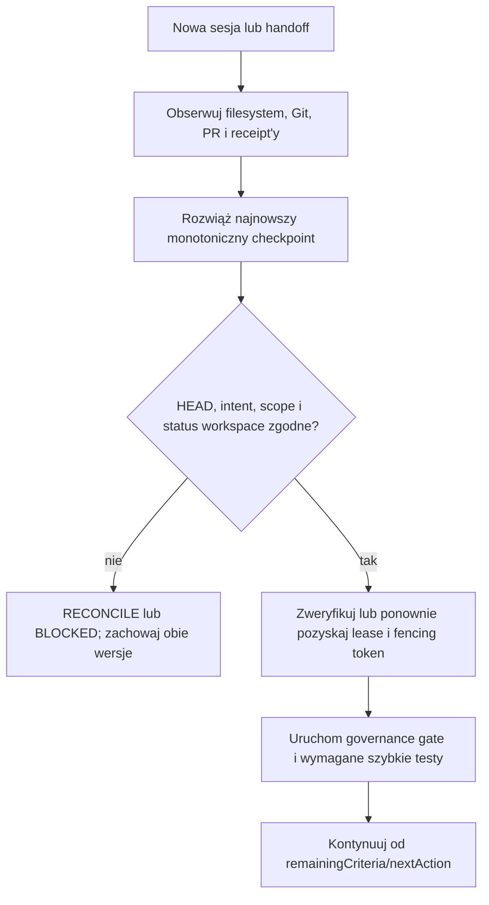

# Ciągłość pracy bez pamięci rozmowy

## Cel

Stan zadania ma być odtwarzalny po kompaktowaniu kontekstu, restarcie hosta LLM,
handoffie między agentami albo utracie procesu. Pamięć rozmowy jest wygodnym
cache'em, ale nie jest źródłem prawdy ani magazynem danych.

Źródłami prawdy pozostają, w tej kolejności:

1. bieżący filesystem i obserwowalny stan Git/PR;
2. zaakceptowany `intent.json` i jego zakres;
3. aktualna dzierżawa oraz chronione receipt'y efektów zewnętrznych;
4. dowody testów i artefaktów wskazane przez niezmienne referencje.

Checkpoint `new-project.work-continuity/v1` jest wyłącznie ograniczoną
projekcją nawigacyjną nad tymi źródłami. Pole `authority` zawsze ma wartość
`advisory-projection`.

## Co musi przetrwać

Checkpoint wiąże bez kopiowania treści:

- kanoniczną, pozbawioną transportu i poświadczeń tożsamość repozytorium,
  ticket, workstream, target branch, branch i dokładny `HEAD`;
- digest całego intentu i jego kanonicznej projekcji zakresu;
- fazę pracy, referencję autoryzacji sesji oraz — gdy istnieje — lease revision
  i fencing token;
- stan workspace: `clean` albo `snapshotted` z referencją i SHA-256 artefaktu
  oraz receiptem zakończonego secret scanu;
- zakończone i pozostałe kryteria odbioru, bounded evidence refs;
- oczekujące efekty z idempotency key oraz jeden typ następnej czynności.

Checkpoint nie zawiera rozmowy, raw logów, diffu, sekretów, absolutnej ścieżki
hosta, treści review ani dowolnego URL. Zamknięty schemat odrzuca dodatkowe
pola.

## Kiedy zapisywać

Agent lub kontroler zapisuje checkpoint:

1. po utworzeniu bounded intent i przyjęciu autoryzacji;
2. po każdym materialnym kamieniu milowym lub zmianie zestawu spełnionych AC;
3. po osiągnięciu `delivery.checkpointMinutes`;
4. przed kompaktowaniem kontekstu, handoffem, restartem, końcem limitu czasu lub
   planowanym przerwaniem procesu;
5. bezpośrednio przed oraz po pushu, utworzeniu PR, uruchomieniu Validatora,
   merge'u i release;
6. przy przejściu do `BLOCKED` albo po błędzie narzędzia pozostawiającym
   użyteczną deltę.

Nie wolno deklarować trwałego checkpointu tylko dlatego, że model opisał stan
w rozmowie. Chroniony kontroler musi zapisać wyemitowany dokument w zewnętrznym
receipt store. Rejestr `.git/new-project/work-continuity.json` jest atomowym,
lokalnym cache'em pomocnym po utracie kontekstu, ale sam nie chroni przed utratą
dysku lub klona.

## Brudny workspace

Brudny workspace jest odtwarzalny tylko w jednym z dwóch wariantów:

- zmiana została zapisana w autoryzowanym commicie na ticket branch; wtedy
  kolejny checkpoint ma stan `clean`;
- uprawniony kontroler utworzył content-addressed snapshot poza Git, wykonał
  secret scan i przekazał `artifact:` ref, SHA-256 oraz `receipt:` skanu; wtedy
  checkpoint ma stan `snapshotted`.

Lokalny stash, surowy patch w tickecie, opis w czacie lub nieśledzony plik bez
artefaktu nie spełniają kontraktu. Gdy bezpieczny snapshot nie jest dostępny,
agent zatrzymuje handoff z `GOV-CONTINUITY-001` i nie udaje, że dane są
zabezpieczone.

## Procedura wznowienia



Kolejność jest obowiązkowa:

1. Najpierw odczytaj bieżące pliki, `git status`, branch/HEAD, stan PR i
   zewnętrzne receipt'y. Checkpoint nie może nadpisać obserwacji.
2. Zweryfikuj cały append-only chain. Ten sam `checkpointRef` nie może wskazać
   innej treści, `checkpointRef` musi odpowiadać SHA-256 kanonicznego payloadu,
   a `sequence` i `previousCheckpointRef` muszą być monotoniczne.
3. Porównaj repository, ticket, intent digests, branch, HEAD i status digest.
4. Przy rozjeździe nie resetuj, nie usuwaj i nie nakładaj snapshotu. Przejdź do
   `reconcile` albo `blocked` i zachowaj nieznane dane.
5. Nie używaj zapisanego fencing tokenu bez ponownej walidacji lease. Stary
   token jest informacją diagnostyczną, nie prawem do zapisu.
6. Dopiero po ponownej walidacji bramki wykonaj `nextAction`; checkpoint nigdy
   nie udziela zgody na sekret, destrukcję, merge ani rozszerzenie celu.
7. Gdy `goal.yaml` wymaga ticket-bound delivery, także temat każdego
   nieopublikowanego commitu musi zaczynać się od dokładnego `[ticket-NNN] `;
   checkpoint ani nazwa brancha nie zastępują tego wiązania.

## Runtime

Pakiet adopcyjny dostarcza `.governance/work_continuity.py` i zamknięty schema.
Przykładowe lokalne użycie po zapisaniu materialnej pracy:

```bash
python3 .governance/work_continuity.py capture \
  --root . \
  --ticket ticket-042 \
  --phase validation \
  --worktree-id project-ticket-042 \
  --authorization-ref authorization:session/ticket-042 \
  --completed AC-01 \
  --remaining AC-02 \
  --next-action validate \
  --next-criterion AC-02
```

Wznowienie zaczyna się od weryfikacji obserwowalnego stanu:

```bash
python3 .governance/work_continuity.py resolve --root . --ticket ticket-042
python3 .governance/work_continuity.py verify --root . --ticket ticket-042
./project/governance-check.sh --actor agent
```

`verify` potwierdza tylko zgodność z obserwowanym repozytorium i jawnie zwraca
`authorityVerified=false`. Kontroler osobno weryfikuje authorization ref, lease
i chronione efekty.

## Wskazówki dla pozostałych standardów

| Właściciel | Wymaganie ciągłości |
| --- | --- |
| `wellmanifest/new-project` | HOME schematu checkpointu, reguł wznowienia, diagnostyki i projekcji adopcyjnej. |
| `wellmanifest/ticket-lifecycle` | Dopuszcza `checkpoint` jako niezmieniającą stanu, append-only transakcję aktywnego ticketu; `resume` nadal rewaliduje authority. |
| `wellmanifest/git-lifecycle` | Definiuje bezpieczny zapis `HEAD` lub zewnętrznego snapshotu; stash i WIP bez receiptu nie są durable. |
| `wellmanifest/logs` | Zapisuje redagowany event checkpoint/resume z correlation ID i outcome; log nie jest bazą stanu. |
| `wellmanifest/worktrees` | Mapuje nieprzenośny katalog na stabilny `worktreeId`; receipt nie zawiera absolutnej ścieżki. |
| `wellmanifest/ssot` | Klasyfikuje checkpoint jako projekcję; intent, Git i chronione registry pozostają SSOT. |
| `subactor` runtime | HOME kontrolera, zewnętrznego receipt store, secret-scanned snapshotów, lease CAS i automatycznych triggerów. ADOPT `wellmanifest/new-project`. |

Każdy standard powinien używać tych samych opaque refs oraz tego samego
`correlationId` po stronie logów, zamiast kopiować payload checkpointu do
własnego formatu.

## Granice retencji

- Przechowuj cały chain dla aktywnego ticketu i co najmniej checkpoint
  bezpośrednio poprzedzający każdy efekt zewnętrzny.
- Po terminalnym merge receipt można skompaktować snapshoty robocze zgodnie z
  retencją i klasyfikacją danych, ale zachować checkpoint refs, digests i
  terminalny receipt.
- Usunięcie snapshotu nie może zmienić historii receiptu; resolver raportuje
  brak artefaktu i blokuje restore zamiast udawać kompletność.
