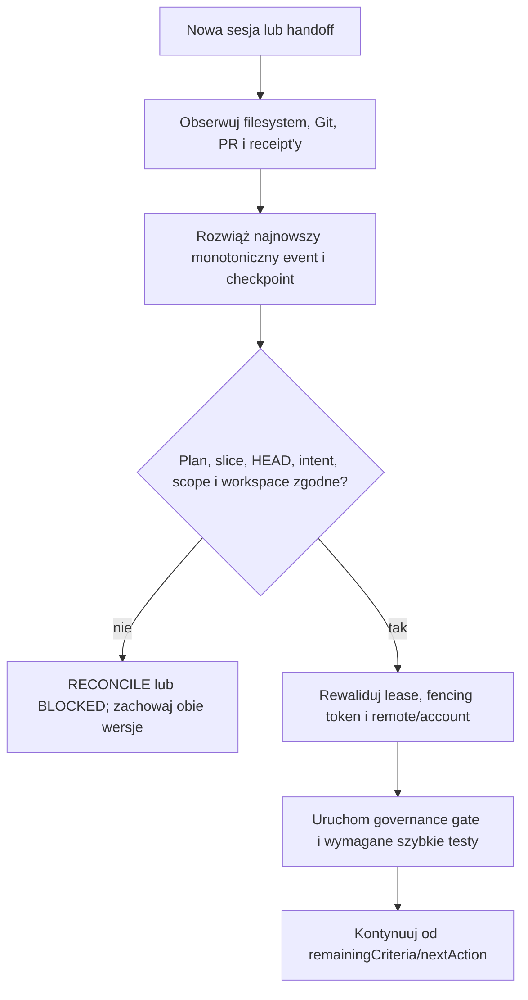

# Ciągłość pracy bez pamięci rozmowy

## Cel

Stan zadania ma być odtwarzalny po kompaktowaniu kontekstu, restarcie hosta LLM,
handoffie między agentami albo utracie procesu. Pamięć rozmowy jest wygodnym
cache'em, ale nie jest źródłem prawdy ani magazynem danych.

Źródłami prawdy pozostają, w tej kolejności:

1. bieżący filesystem i obserwowalny stan Git/PR;
2. zaakceptowany `intent.json` i jego zakres;
3. aktualna dzierżawa oraz chronione receipt'y efektów zewnętrznych;
4. dowody testów i artefaktów wskazane przez niezmienne referencje.

Checkpoint `new-project.work-continuity/v2` jest wyłącznie ograniczoną
projekcją nawigacyjną nad tymi źródłami. Pole `authority` zawsze ma wartość
`advisory-projection`.

## Co musi przetrwać

Checkpoint wiąże bez kopiowania treści:

- kanoniczną, pozbawioną transportu i poświadczeń tożsamość repozytorium,
  ticket, workstream, target branch, branch i dokładny `HEAD`;
- digest całego intentu i jego kanonicznej projekcji zakresu;
- dokładne, content-addressed bindings planu i slice'u wykonywanego przez
  bieżącą sesję;
- fazę pracy, referencję autoryzacji sesji oraz — gdy istnieje — lease revision
  i fencing token;
- redagowaną obserwację remote/account wraz z receiptem i czasem obserwacji;
- stan workspace: `clean` albo `snapshotted` z referencją i SHA-256 artefaktu
  oraz osobnymi receiptami snapshotu i zakończonego secret scanu;
- zakończone i pozostałe kryteria odbioru, bounded evidence refs;
- oczekujące efekty z idempotency key oraz jeden typ następnej czynności.

Checkpoint nie zawiera rozmowy, raw logów, diffu, sekretów, absolutnej ścieżki
hosta, treści review ani dowolnego URL. Zamknięty schemat odrzuca dodatkowe
pola.

## Kiedy zapisywać

Agent lub kontroler zapisuje checkpoint:

1. po utworzeniu bounded intent i przyjęciu autoryzacji;
2. po każdym materialnym kamieniu milowym lub zmianie zestawu spełnionych AC;
3. po osiągnięciu `delivery.checkpointMinutes`;
4. przed kompaktowaniem kontekstu, handoffem, restartem, końcem limitu czasu lub
   planowanym przerwaniem procesu;
5. bezpośrednio przed oraz po pushu, utworzeniu PR, uruchomieniu Validatora,
   merge'u i release;
6. przy przejściu do `BLOCKED` albo po błędzie narzędzia pozostawiającym
   użyteczną deltę.

Nie wolno deklarować trwałego checkpointu tylko dlatego, że model opisał stan
w rozmowie. Chroniony kontroler musi zapisać wyemitowany dokument w zewnętrznym
receipt store. Każdy host dopisuje ten sam zamknięty event JSON do
`.subactor/sessions/work-continuity.jsonl`; stream jest append-only i nie ma
limitu rozmiaru polityki. Mały
`.subactor/recovery/checkpoint-index.json` przechowuje wyłącznie najnowsze
referencje (maksymalnie 128, 256 KiB), jest zapisywany przez atomic replace i
może zostać odbudowany ze streamu. Oba pozostają ignorowanym, lokalnym cache'em
i same nie chronią przed utratą dysku lub klona.

## Brudny workspace

Brudny workspace jest odtwarzalny tylko w jednym z dwóch wariantów:

- zmiana została zapisana w autoryzowanym commicie na ticket branch; wtedy
  kolejny checkpoint ma stan `clean`;
- uprawniony kontroler utworzył content-addressed snapshot poza Git, wykonał
  secret scan i przekazał `artifact:` ref, SHA-256, receipt snapshotu oraz
  receipt skanu; wtedy checkpoint ma stan `snapshotted`.

Lokalny stash, surowy patch w tickecie, opis w czacie lub nieśledzony plik bez
artefaktu nie spełniają kontraktu. Gdy bezpieczny snapshot nie jest dostępny,
agent zatrzymuje handoff z `GOV-CONTINUITY-001` i nie udaje, że dane są
zabezpieczone.

## Procedura wznowienia



Kolejność jest obowiązkowa:

1. Najpierw odczytaj bieżące pliki, `git status`, branch/HEAD, stan PR i
   zewnętrzne receipt'y. Checkpoint nie może nadpisać obserwacji.
2. Zweryfikuj oba append-only chainy. Te same `eventRef` i `checkpointRef` nie
   mogą wskazywać innej treści; referencje odpowiadają SHA-256 kanonicznych
   payloadów, a sekwencje i previous refs są monotoniczne.
3. Porównaj repository, plan, slice, ticket, intent digests, branch, HEAD i
   status digest.
4. Przy rozjeździe nie resetuj, nie usuwaj i nie nakładaj snapshotu. Przejdź do
   `reconcile` albo `blocked` i zachowaj nieznane dane.
5. Nie używaj zapisanego fencing tokenu ani account ref bez ponownej obserwacji
   remote i walidacji lease. Stare dane są diagnostyką, nie prawem do zapisu.
6. Dopiero po ponownej walidacji bramki wykonaj `nextAction`; checkpoint nigdy
   nie udziela zgody na sekret, destrukcję, merge ani rozszerzenie celu.
7. Gdy `goal.yaml` wymaga ticket-bound delivery, także temat każdego
   nieopublikowanego commitu musi zaczynać się od dokładnego `[ticket-NNN] `;
   checkpoint ani nazwa brancha nie zastępują tego wiązania.

## Runtime

Pakiet adopcyjny dostarcza `.governance/work_continuity.py` i zamknięty schema.
Przykładowe lokalne użycie po zapisaniu materialnej pracy:

```bash
python3 .governance/work_continuity.py capture \
  --root . \
  --ticket ticket-042 \
  --session-id session-042-a \
  --phase validation \
  --worktree-id project-ticket-042 \
  --authorization-ref authorization:session/ticket-042 \
  --plan-ref artifact:plan/ticket-042/v3 \
  --plan-sha256 0123456789abcdef0123456789abcdef0123456789abcdef0123456789abcdef \
  --slice-ref artifact:slice/ticket-042/2 \
  --slice-sha256 abcdef0123456789abcdef0123456789abcdef0123456789abcdef0123456789 \
  --slice-ordinal 2 --slice-total 3 \
  --remote-account-ref account:github/operator \
  --remote-observation-receipt receipt:remote-observation/ticket-042/7 \
  --completed AC-01 \
  --remaining AC-02 \
  --next-action validate \
  --next-criterion AC-02
```

Wznowienie zaczyna się od weryfikacji obserwowalnego stanu:

```bash
python3 .governance/work_continuity.py resolve --root . --ticket ticket-042
python3 .governance/work_continuity.py verify --root . --ticket ticket-042
python3 .governance/work_continuity.py rebuild-index --root .
./project/governance-check.sh --actor agent
```

`verify` potwierdza tylko zgodność z obserwowanym repozytorium i jawnie zwraca
`authorityVerified=false` i `remoteAccountMustBeReobserved=true`. Kontroler
osobno weryfikuje authorization ref, lease, konto remote i chronione efekty.

Pre-commit uruchamia wyłącznie `verify-pin --staged`: czyta lokalny manifest,
adoption lock i managed digests. Nie wykonuje fetchu ani żadnej mutacji.
Świeżość zapewnia jawne uruchomienie `scripts/create_adoption_lock.py` z
dokładnym opublikowanym `--source-revision` albo bot wykonujący tę samą
transakcję, nigdy hook commitowy. Target ze starym szerokim `/.subactor/`
najpierw zawęża własny ignore w osobnym, autoryzowanym changesecie; updater
fail-closuje zamiast samodzielnie przejmować lub przepisywać target-owned plik.

## Wskazówki dla pozostałych standardów

| Właściciel | Wymaganie ciągłości |
| --- | --- |
| `wellmanifest/new-project` | HOME schematu checkpointu, reguł wznowienia, diagnostyki i projekcji adopcyjnej. |
| `wellmanifest/ticket-lifecycle` | Dopuszcza `checkpoint` jako niezmieniającą stanu, append-only transakcję aktywnego ticketu; `resume` nadal rewaliduje authority. |
| `wellmanifest/git-lifecycle` | Definiuje bezpieczny zapis `HEAD` lub zewnętrznego snapshotu; stash i WIP bez receiptu nie są durable. |
| `wellmanifest/logs` | Zapisuje redagowany event checkpoint/resume z correlation ID i outcome; log nie jest bazą stanu. |
| `wellmanifest/worktrees` | Mapuje nieprzenośny katalog na stabilny `worktreeId`; receipt nie zawiera absolutnej ścieżki. |
| `wellmanifest/ssot` | Klasyfikuje checkpoint jako projekcję; intent, Git i chronione registry pozostają SSOT. |
| `subactor` runtime | HOME kontrolera, zewnętrznego receipt store, secret-scanned snapshotów, lease CAS i automatycznych triggerów. ADOPT `wellmanifest/new-project`. |

Każdy standard powinien używać tych samych opaque refs oraz tego samego
`correlationId` po stronie logów, zamiast kopiować payload checkpointu do
własnego formatu.

## Granice retencji

- Append-only event stream nie ma limitu rozmiaru polityki. Retencja lub
  archiwizacja jest osobnym, autoryzowanym efektem runtime i nie może
  przepisywać istniejących eventów.
- Bounded indeks zachowuje maksymalnie 128 najnowszych ticket bindings; brak
  starszego wpisu nie usuwa odpowiadającego eventu ze streamu.
- Po terminalnym merge receipt można skompaktować snapshoty robocze zgodnie z
  retencją i klasyfikacją danych, ale zachować checkpoint refs, digests i
  terminalny receipt.
- Usunięcie snapshotu nie może zmienić historii receiptu; resolver raportuje
  brak artefaktu i blokuje restore zamiast udawać kompletność.
