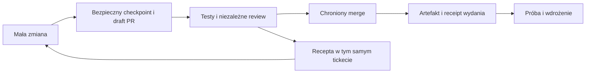

---
{
  "schema": "wellmanifest.docs/document/v1",
  "id": "controlled-change-streaming",
  "kind": "information",
  "version": 6,
  "title": "Kontrolowane streamowanie i recepty odzyskiwania postępu",
  "status": "proposed",
  "owner": "wellmanifest/new-project",
  "created": "2026-09-13",
  "updated": "2026-09-14",
  "review_after": "2026-10-13",
  "source_revision": "2ff425ca98767a22c075c50eccf7d29ef34709c3",
  "affected_repositories": ["wellmanifest/new-project"],
  "evidence": [
    "https://github.com/wellmanifest/new-project/blob/a5ffa7dd5d0bb5cafbcefbb180204874787c0758/scripts/branch_lifecycle_check.py",
    "https://github.com/wellmanifest/new-project/blob/a5ffa7dd5d0bb5cafbcefbb180204874787c0758/governance/diagnostics.json",
    "https://github.com/wellmanifest/new-project/pull/341",
    "https://docs.github.com/en/pull-requests/reference/pull-requests",
    "https://docs.github.com/en/repositories/configuring-branches-and-merges-in-your-repository/managing-protected-branches/about-protected-branches"
  ]
}
---

# Kontrolowane streamowanie zmian

<!-- docs:section purpose -->
## Cel

Standard ma umożliwiać szybki przepływ małych, niezależnych zmian, zachowując
fail-closed authority dla efektów zewnętrznych. Konflikt techniczny nie jest
automatycznie konfliktem semantycznym: dwa branche mogą dotykać tego samego
pliku, ale nadal dać się bezpiecznie zrebasować albo scalić w ustalonej
kolejności.

<!-- docs:section scope -->
## Zakres i status

Właścicielem tej procedury jest `wellmanifest/new-project`. Obecna poprawka
uzgadnia diagnostyki i recepty w zarządzanych plikach. **Nie wprowadza nowego
trybu push, nie zmienia exit codes ani wymaganych bramek.** Rozdzielenie
bramek poniżej jest projektem następnej, jawnej adopcji standardu i publikatora.
POLICY/CONTRIBUTING i przypięty runtime nadal określają dopuszczalne efekty.

Poprawka ticketu 225 dodaje wąskie rozpoznanie historycznej zawartości w lokalnym
guardzie admission. Branch bez worktree nie koliduje, jeżeli pełne drzewa
**wszystkich** jego odrębnych commitów występują na ścieżce obserwowanego
targetu po wspólnym przodku. Nowy zamiar rollbacku nie może zostać uznany za
zintegrowany przez dopasowanie do stanu sprzed rozgałęzienia.
Ref nadal pozostaje w inwentarzu. Nie wystarcza podobieństwo plików,
patch-id ani zgodność samego HEAD. Brudne/aktywne worktree i WIP zachowują
dotychczasowe kontrole. To nie jest nowy tryb push, dowód aktualnego zachowania,
zamknięcie ticketu ani zgoda na cleanup.

Ticket 226 dodaje **działający, opcjonalny odczyt publikacji**, opisany poniżej.
Nie dodaje publikatora, dashboardu ani uprawnień i nie wymaga sieci w domyślnym
admission. Odczyt można wykorzystać jako wejście do CLI/Web wykonawcy.

Ticket 227 usuwa zależność testów adopcji i walidatora od bieżącego numeru
wydania. Oczekiwana wersja pochodzi z kanonicznego VERSION lub manifestu
danego fixture; błędna wersja jest celowo różna także wtedy, gdy źródło ma
wersję `9.9.9`. Projekcje `0.20.28` towarzyszą tej materialnej poprawce.
Sam merge źródeł nadal nie oznacza wydania ani adopcji: potrzebny jest
nienadpisany tag na dokładnym zaakceptowanym merge SHA, odczyt opublikowanego
wydania i dopiero potem zarządzana adopcja z przypiętej rewizji.

<!-- docs:section evidence -->
## Dowody i ograniczenia wnioskowania

Na wskazanej rewizji runtime emituje `GOV-BRANCH-LIFECYCLE-002` dla brancha
bez otwartego PR, a `003` dla wadliwej obserwacji. Katalog kierował te przypadki
do zamienionych opisów. Test `tests/branch-lifecycle.test.sh` wiąże obecnie
trzy rzeczywiste przypadki z katalogiem oraz już zarządzanym runbookiem.
Samo istnienie zdalnego brancha nie dowodzi aktywnego writera, osierocenia ani
utraty kodu; snapshot v1 nie zawiera danych wystarczających do takiej oceny.

GitHub rozróżnia draft PR i merge: draft nie jest scalalny, a chroniony branch
zachowuje wymagane kontrole. To uzasadnia proponowane rozdzielenie etapów,
ale nie oznacza, że obecny publikator wellmanifest już takie tryby obsługuje.
[Draft PR](https://docs.github.com/en/pull-requests/reference/pull-requests),
[ochrona branchy](https://docs.github.com/en/repositories/configuring-branches-and-merges-in-your-repository/managing-protected-branches/about-protected-branches).

<!-- docs:section content -->
## Dostępne teraz: jeden odczyt zamiast zgadywania stanu push

```bash
python3 scripts/work_start_check.py --root . --workstream governance \
  --ticket ticket-226 --observe-publication
```

Adopter używa `.governance/work_start_check.py` oraz własnego deklarowanego
workstreamu i ticketu. Pole `publication` ma wersję
`new-project.publication-observation/v1` i adres schematu
`urn:wellmanifest:new-project:schema:work-start-report:v1#publicationObservation`.
Przenosi czas obserwacji, digest refów, HEAD każdego worktree, liczbę brudnych
ścieżek, liczbę commitów nieobecnych na obserwowanych branchach `origin`,
branche zawierające HEAD, zgodność brancha oraz ancestry targetu. Ten sam
model jest niezależny od języka konsumenta; CLI/Web nie powinny odtwarzać
tych reguł osobnymi heurystykami.

Przykład rozstrzygnięcia: `unpublishedCommitCount=0`,
`sameBranchContainsHead=false`, `headReachableFromTarget=false` oznacza kod
wysłany na inny branch, a nie wykonany merge lub utracony push. Brudne ścieżki
nadal wymagają zachowania. Wyliczenie obejmuje tylko `origin-heads`, nie tagi,
ukryte refy PR ani inne serwery. `null` oznacza brak dowodu, nigdy zero.

Odczyt nie pobiera obiektów ani nie zmienia refów/indeksu. Niepełne obiekty
i shallow clone dają `partial`, błąd remote — `unavailable`, zmiana ponownej
reklamy refów — `changed` i unieważnienie zdalnych faktów. Wynik nie jest
atomowym snapshotem serwera. Pełny raport może zawierać prywatne ścieżki
i nazwy branchy; przechowuj go poza historią repo, a widok współdzielony
minimalizuj. Brak dostępu do GitHub nie blokuje lokalnego admission.

PR, checki, approval, chroniony merge, release i deploy są jawnie wymienione
jako **niezaobserwowane**, a `grantsAuthority=false`. Ich stan wymaga własnych
receiptów i aktualnego odczytu przez uprawnionego wykonawcę. Wersję helpera
i zamkniętego schematu przypinaj razem — stary schemat nie przyjmie nowego
opcjonalnego pola. Testy obejmują rzeczywiste lokalne remotes i płytki klon,
błędne/zmienne odpowiedzi oraz niezmienność indeksu i refów.

## Recepta zamiast samego STOP

Przed kolejną próbą zidentyfikuj konkretny skutek i zastosuj istniejący runbook.
Odpowiedź powinna zawierać następny ograniczony krok, istniejącą autoryzację,
warunek powodzenia i zachowany stan na wypadek niepowodzenia. Brakujące dane
zbieraj odczytem; pytaj tylko o brakującą decyzję dotyczącą skutku. Recepta nie
może być nowym źródłem uprawnień ani poleceniem dowolnego shell wygenerowanym
przez LLM. Dla wieloetapowej naprawy używaj już przyjętego remediation intent,
nie kolejnego formatu DSL lub bazy ticketów.

| Sytuacja | Zalecana następna czynność | Dowód zakończenia / bezpieczny stan |
| --- | --- | --- |
| Timeout push lub utworzenia PR | odczyt zdalnego refa i PR przed retry | dokładny oczekiwany SHA i istniejący PR; inaczej zachowany pending effect |
| Ten sam deterministyczny błąd | diagnoza przyczyny, poprawka właściwego wejścia, ponowna walidacja | zmieniony digest wejścia; brak nowych ticketów za samo ponowienie |
| Historyczny branch bez otwartego PR | odczyt zamkniętych PR, HEAD i pozostałego intentu; zachowanie pracy | kontynuacja istniejącej dostawy albo jawna dyspozycja po reconciliation; nie automatyczne usunięcie |
| Fałszywa blokada wynikająca ze wspólnej historii | porównanie rzeczywistych delt od wspólnego przodka | test regresji u właściciela checkera; nie blanket ignore |
| Limit nowego małego zadania naliczony od starej niezarządzanej historii | sklasyfikowanie historycznej bazy i bieżącej delty | plan kontrolowanej migracji; bez przepisywania commitów lub podnoszenia limitu całego repo |
| Lokalny test PASS, publiczna funkcja nie działa | sprawdzenie obrazu/rewizji wdrożenia i rzeczywistego scenariusza | dowód zachowania aplikacji; HTTP 200 nie zastępuje działającego chatu |

Nie resetuj licznika prób przez restart agenta lub nowe NL. Ponawianie błędów
przejściowych ma limit i odstęp zapisane przy tej samej operacji. Po ich
wyczerpaniu zachowaj jeden oczekujący krok i kontynuuj rozłączną pracę.

## Docelowo: bramki według skutku, nie jedna bramka do wszystkiego

| Etap | Minimalna ochrona | Co nie jest jego dowodem |
| --- | --- | --- |
| Checkpoint na branchu + draft PR | autoryzacja, zakres, aktualny lease, brak sekretów w całej wysyłanej historii, dokładny ref, brak force | pełna gotowość funkcji lub niezależne approval |
| Integracja na main | bieżące wymagane testy, uzgodniony intent, niezależne exact-head review, chroniony kontroler | samo utworzenie PR lub test lokalny |
| Release / paczka | zaakceptowany merge, odtwarzalny artefakt, nienadpisany tag/digest, odczyt rejestru | sam plik VERSION lub obraz obecny lokalnie |
| Deploy | izolowana próba, przypięty artefakt, autoryzowany przełącznik, weryfikacja funkcji i rollback | udany push albo samo uruchomienie kontenera |



W proponowanym profilu niedokończona funkcja może mieć FAIL widoczny w draft,
ale nigdy uzyskać dzięki temu merge. Problem sekretów, zakresu lub authority
zatrzymuje już checkpoint do GitHub. Gdy obecny profil nie potrafi bezpiecznie
zapisać postępu, stosuje się przyjęty secret-scanned snapshot z receipt, nie
`--no-verify` ani ręcznie wygenerowane zielone statusy.

Cache dowodów wymaga pełnego klucza: base/head, intent, polityka, lock, runtime,
wersja zestawu testów i wejścia zewnętrzne. Zmiana któregoś elementu unieważnia
zależne wyniki. Nie przenoś approval na nowe SHA; cache nie jest trust rootem.
Runtime produkcyjny powinien używać przypiętych artefaktów poza checkoutem
writera; stan i sekrety są odrębne od kodu. Sprawdzaj rzeczywiście serwowane
bajty i zachowanie, nie tylko plik widoczny na hoście.

## Reguła deeskalacji

Kontroler klasyfikuje kolizję przed blokadą i zapisuje decyzję oraz receipt:

| Klasa | Warunek | Działanie |
| --- | --- | --- |
| `parallel` | rozłączne scope i brak zależności | niezależne worktree oraz PR |
| `rebase` | wspólna baza, konflikt Git rozwiązywalny bez zmiany kontraktu | rebase na aktualnym `main`, ponowne testy i exact-head validation |
| `split` | część scope jest niezależna | zachować wspólny ancestor, wydzielić następcę z nowym scope i ticketem |
| `serialize` | wspólny kontrakt lub ścieżka integracyjna | ustawić deterministyczną kolejność przez dependency, bez wzajemnego oczekiwania |
| `handoff` | writer utracił aktualność, lecz delta pozostaje użyteczna | fenced successor przejmuje scope; poprzednik dostaje receipt `superseded` |
| `block` | konflikt semantyczny, brak authority lub nieweryfikowalny stan | zatrzymać tylko dany scope i zwolnić niepowiązane rezerwacje |

Żaden wariant nie zezwala na bezpośredni merge, zmianę zamrożonego headu ani
nadpisanie cudzej pracy.

## Pozostałe implementacje

1. **Graf naprawy z istniejących kontraktów** — komponować remediation intent,
   rejestr operacji i pending effects; nie tworzyć konkurencyjnego DSL/ticket
   store. Każdy flow wiąże repository scope, lease URI, zależności, strategię
   deeskalacji, idempotency key i oczekiwany receipt. Walidacja odrzuca cykle,
   niejednoznaczne scope i retry bez idempotency key. Nowa wersja kontraktu
   wymaga wykazanej luki i migracji, nie samej potrzeby kolejnego widoku.
2. **Atomowa alokacja workspace** — rozszerzyć registered allocator tak, aby
   jeden receipt zawierał ticket, branch, kanoniczny worktree path, lease URI i
   fencing token. CLI nie może samodzielnie zgadywać numeru lub tworzyć branch
   przed potwierdzoną alokacją.
3. **Handoff lease** — zmienić `supersede` na dwuetapowe `prepare-handoff` /
   `accept-handoff`. Następca jest najpierw fenced i otrzymuje identyczny
   `scopeHash`; dopiero potem poprzednik jest zwalniany. Terminalny receipt nie
   może być warunkiem utworzenia następcy.
4. **Kolejka integracyjna wielu repozytoriów** — manifestuje graph zależności
   PR/release między repozytoriami. Gotowe elementy wykonują się równolegle,
   a każdy shared contract ma jeden integration owner oraz określoną kolejność.
5. **Obserwowalność zgodna z `wellmanifest/logs`** — każdy transition i
   deeskalacja emituje ustrukturyzowany event z `correlationId`, `flowId`,
   `leaseId`, `fencingToken`, klasą decyzji, retry count i `ERROR` code. Logi
   nie zawierają sekretów, pełnych diffów ani ścieżek hosta.
6. **Kontrolowane wdrożenie** — najpierw dry-run i raport tylko dla jednej
   organizacji, potem canary repozytoriów z aktywną pracą, a dopiero później
   wymóg dla registered allocation. Każdy etap ma miernik: stale lease,
   collision rate, retry success i czas od merge do następnego gotowego PR.
7. **Release jako część flow** — release wymaga receiptu merge aktualnego
   `main`, dokładnego SHA, zielonych checków i nieistniejącego tagu. Nie wolno
   publikować tagu/release przed merge'em PR przygotowującego wersję.

## Kryterium gotowości

Nowy mechanizm jest gotowy do obowiązkowego użycia dopiero, gdy testy symulują
jednoczesny rebase, split i handoff w dwóch repozytoriach, a każde zakończenie
ma monotoniczny, weryfikowalny receipt chain.

<!-- docs:section limitations -->
## Ograniczenia

Pozostaje luka zgodności z przypiętym `wellmanifest/docs`
(`ebe7501063ef4f3e63ded610c2d3183010ca636e`): jego automatyczne odkrywanie
nowego `error/GOV-APPROVAL.md` zgłasza `DOCS_METADATA`, chociaż lokalny
kontrakt diagnostyk wymaga runbooka właśnie w `error/*.md`. Nie wolno przenosić
recepty do pliku wyłączonego z odkrywania ani zmieniać pinów ręcznie. Następna
poprawka u właściciela docs powinna rozpoznawać kontraktowo zarządzane runbooki
i testować je ich właściwym walidatorem; dowolny raport w `error/` nie może
otrzymać ogólnego wyjątku. Ta zmiana nie twierdzi, że luka została naprawiona.

Recepty i poprawione opisy nie uruchamiają efektów ani nie zmieniają dziś
`GOV-BRANCH-LIFECYCLE-002` z error na warning. Sprzeczność między zachowaniem
niescalonej gałęzi a wymaganiem samego default brancha wymaga spójnej zmiany
POLICY/CONTRIBUTING, runtime i chronionego profilu; nie wolno rozwiązać jej
usunięciem nieznanej pracy. Snapshot v1 nie uwierzytelnia ownership ani disposal.
Nie potwierdzamy wdrożenia przyszłego kontrolera ani aktualności wszystkich
adopterów przez sam merge standardu.

<!-- docs:section next_actions -->
## Kolejność małych zmian

Zielony PR bez review nie wymaga ponownego pushu. Diagnostyki `GOV-APPROVAL-*`
prowadzą do [recepty odzyskania postępu](../../error/GOV-APPROVAL.md): odczyt
istniejącego requestu, przekazanie do skonfigurowanego niezależnego kontrolera,
ograniczone oczekiwanie z widoczną fazą i readback przed retry. Recepta jest
częścią manifestu pakietu; nie instaluje kontrolera ani nie dodaje nowej bramki.
Po źródłowym merge dopiero wydanie i zarządzana adopcja udostępnią ją adopterom.

1. Przy adopcji odczytu publikacji przeliczyć cały zarządzany pakiet
   z opublikowanej rewizji, bez ręcznego edytowania kopii `.governance`.
   Testy wydania porównują wersję z kanonicznym źródłem; negatywny mismatch
   nie może stać się identyczny ze źródłem po podniesieniu wersji. Po
   opublikowaniu wydania wykonać canary i kontrolowany rollout. Nie zmieniać
   testów na zgodę dla nieopublikowanej rewizji u produkcyjnego adoptera.
   Merge źródeł nie oznacza adopcji.
2. W `new-project` uzgodnić efektowy profil checkpoint/merge/release z
   `wellmanifest/git-lifecycle` oraz jego wykonawcą Goal. Najpierw test canary:
   funkcjonalny FAIL pozostaje widoczny w draft; sekret, obcy scope, stale lease
   i próba main push zatrzymują zapis; merge nie przyjmuje FAIL ani UNKNOWN.
3. W profilu branch lifecycle oddzielić higienę repo od uprawnień bieżącej
   dostawy. Pozostawiona, jawnie zarejestrowana praca powinna prowadzić do
   reconciliation, a nie wymuszać atrapowego PR lub kasowania. Uwierzytelnienie
   rejestracji pozostaje po stronie kontrolera, nie pola wpisanego w PR.
4. `wellmanifest/worktrees` i `ticket-lifecycle` zachowują reuse-first oraz
   bounded scope; `repair-lifecycle` określa próbę, read-back i rollback, a
   `wellmanifest/taskand` wiąże te efekty przez wersjonowane URI/URN. Nie
   powielają katalogu operacji ani ticket store należących do wykonawcy.
5. Wykonawca utrwala pending effects i wynik obserwacji przed retry. Testy:
   utrata odpowiedzi po udanym push, restart, zmiana HEAD, konflikt writera,
   opóźniony status CI i nieudany deploy. Włączenie obowiązku dopiero po canary.
6. W Taskand dodać wspólny widok CLI/Web: osobny stan local/push/PR/checks/
   review/merge/release/deploy, exact HEAD, wiek dowodu, właściciel następnego
   kroku, kod błędu i dostępna recepta. DAG pokazuje zależności, nie pozorny
   procent ukończenia. Integracja tego UI pozostaje do wykonania w Taskand.
7. W Goal wykonywać tani preflight tożsamości ticketu/brancha, formatu
   commitów, konfiguracji i pinów przed długim zestawem testów. Mierzyć czas
   faz i pokazywać heartbeat. Nie pomijać testów ani odczytu exact HEAD
   przed efektem; nie ponawiać niezmienionego błędu deterministycznego.

Mierniki: czas od pierwszej materialnej zmiany do potwierdzonego push, wiek
niewypchniętej delty, liczba identycznych ponowień, czas oczekiwania na każdą
bramkę i niezamierzone duplikaty ticketów/worktree. Celem pilota jest jeden
efekt dla jednego idempotency key, brak utraty pracy i brak regresji kontroli
merge; limity czasu dobiera się z pomiarów projektu, nie arbitralnej liczby
dodatkowych plików lub dokumentów.
