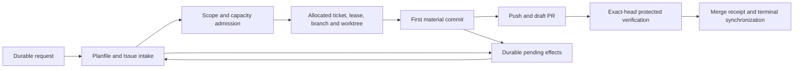

---
{
  "schema": "wellmanifest.docs/document/v1",
  "id": "work-registration",
  "kind": "information",
  "version": 2,
  "title": "Durable project-owned work registration",
  "status": "proposed",
  "owner": "wellmanifest/new-project",
  "created": "2026-09-13",
  "updated": "2026-09-13",
  "review_after": "2026-10-13",
  "source_revision": "e9981f2c4067f68037116e3662f5ad2e51467fed",
  "affected_repositories": ["wellmanifest/new-project"],
  "evidence": [
    "https://github.com/wellmanifest/new-project/issues/330",
    "https://github.com/semcod/planfile/pull/72",
    "https://github.com/semcod/planfile/pull/73"
  ]
}
---

# Durable project-owned work registration

<!-- docs:section purpose -->
## Purpose

An authorized request must remain discoverable while waiting for a workstream,
GitHub, validation or a process restart. A branch or hidden worktree alone is
insufficient task storage. This contract binds the project-owned Planfile
record to the governance ticket, GitHub Issue, implementation worktree, lease
and eventual PR. Waiting records do not reserve editing capacity.

<!-- docs:section scope -->
## Scope and authority

Wellmanifest owns this specification, its closed snapshot
[schema](../../governance/work-registration.schema.json) and its read-only
[checker](../../scripts/work_registration.py). A product controller in
`semcod` or `subactor` owns installation, request intake, journal persistence,
GitHub synchronization and Git effects. The existing governance/Registry
allocator remains the authority for governance ticket IDs. Planfile IDs and
GitHub numbers are projections linked to that identity, not competing ticket
allocators.

This is an additive source contract. It is not yet installed by the published
0.20.26 package, invoked by every adopter's commit hook, or implemented by the
Goal controller. A conforming controller must enforce the requirements below;
merging these files alone does not establish fleet enforcement. The existing
worktree, lease, approval and protected publication policies remain applicable.

A snapshot and a PASS result grant **no execution, cleanup or merge authority**.
The checker checks consistency of supplied observations. It cannot authenticate
an Issue, installation receipt, lease, journal or inventory completeness claim.
The protected controller must acquire and verify those independently, bind them
to the repository and exact revision, and reobserve before any effect. Never
accept a PR-authored registration document as protected approval evidence.

<!-- docs:section content -->
## Required installation and identity

Each adopting repository must have its own explicit Planfile configuration and
store. The controller must install its declared Planfile tool dependency in an
isolated runtime pinned to an immutable source revision, and verify both the
installed revision and project-selection capability before admitting editing.
This is a development tool dependency; it must not become an unrelated
application's production Python dependency. Missing installation or failed
project selection leaves the request waiting with a durable recovery record.

The `planfile` snapshot object binds `project`, `version`, `sourceRevision`,
repository-relative `configPath` and `installationReceipt`. The receipt must
cover installation, configuration and an actual readback from the selected
project. A changed installation requires a fresh receipt. A version string,
executable on PATH or global cached Planfile instance is insufficient. Never
silently fall back to another project when an explicit path is missing.

Request identity is the pair `(repository, request.id)`. The controller allocates
this stable identity before attempting remote operations and preserves it on
retry. The same request keeps the same Planfile ticket and GitHub Issue. Issue
and PR numbers are interpreted only within the snapshot's exact repository.
The collector must confirm their actual repository identity before emitting the
snapshot. Different repositories may use the same local `PLF-001` without
sharing a store or overwriting each other.

## Lifecycle and recovery



1. Persist the request and its operation journal before creating an Issue or
   Planfile record. Recover an existing remote object by stable request identity
   after a timeout; do not blindly repeat a create call. A missing Issue or
   Planfile projection is permitted in queued/blocked intake only when its
   corresponding recovery effect is recorded. It prevents complete registration.
2. Queue without allocating a branch, worktree or editing lease. `queued` has
   no implementation binding. `blocked` may retain a previous worktree for
   recovery but must release its editing reservation. Neither state authorizes
   source edits or ownership transfer.
3. After admission, invoke the managed allocator under its declared consistency
   boundary. Before creating a branch, bind the allocated `ticket-NNN`, exact
   owner and fenced lease. Its `ownerActor`, `ownerSession` and `scopeHash`
   remain explicit in the snapshot for recovery and handoff. The binding uses `ticket/NNN-description` and
   `.worktrees/ticket-NNN--description`, relative to the registered primary.
   Verify Git capabilities and the actual filesystem through Worktrees v5.
4. Record `materialHead` only after a material implementation commit exists.
   Publish it and create a draft PR, then obtain an independent PR observation.
   Before a material commit, no PR is required and an empty planning PR is
   rejected. A failed push or PR operation remains in the durable outbox and
   prevents complete registration; it never becomes a fabricated success.
5. `publication` requires a material head, a PR observing that exact head and a
   frozen publication lease. Return to editing before changing a frozen head.
   A new material head needs fresh lease revision and fencing observations.
   Existing PR identity is preserved across revisions and re-review.
6. `merged` requires its external terminal receipt and a released lease;
   `cancelled` requires the relevant independently verified owner/controller
   terminal decision. These references do not themselves prove authority.
   Synchronize terminal state to Planfile and GitHub through the controller.
   Never create a repository closure commit. Preserve terminal request history.
   Cancellation preserves unpublished material commits without requiring a new
   PR; an existing PR identity and its observed head remain bound to the record.

The outbox contains only outstanding operations: `ensure-issue`,
`ensure-planfile-ticket`, `ensure-worktree`, `ensure-pr`, `sync-terminal`.
Each entry binds its request, a durable `journalReceipt` and an idempotency key:
SHA-256 of the UTF-8 JSON array `[repository, requestId, effect]`, serialized
with ASCII escaping and no whitespace. The checker exports `effect_key` for
reproducible fixtures. Successful effects are removed from the outbox only after
their verified result is durably recorded in the controller journal and snapshot.
Local removal of an entry is not proof that an operation succeeded.

An interruption between branch creation, worktree creation and registration
must remain recoverable from that journal. Record observed partial artifacts,
retain an `ensure-worktree` effect and stop dependent editing until exact owner,
lease and placement are reconciled. Do not create a second allocator, hide a
partially created worktree or use a stale lease to finish another writer's work.

## Snapshot and journal validation

The portable snapshot records configuration, requests, outstanding effects and
an inventory of linked checkouts. `inventoryComplete=false` is explicitly
incomplete. External/unknown placement uses an opaque worktree ID and null path;
never insert host absolute paths into the shared snapshot. Unregistered
checkouts, including dirty or unknown legacy work, produce pending findings.
The checker never follows snapshot paths, creates directories, contacts GitHub,
invokes Planfile, runs Git or removes worktrees.

Snapshots start at sequence 1 with null `previousDigest`. Every subsequent
snapshot increments the sequence and binds the prior snapshot using SHA-256 of
sorted-key ASCII-escaped JSON without whitespace or non-finite values. Pass the
previous snapshot to validate that adjacent transition. The controller verifies
the complete durable chain and receipt authenticity separately. An omitted
previous snapshot, disappearing request, replaced identity, regressed fencing
or rewritten terminal record is invalid. Archival needs a future explicit
archive protocol; silently dropping old records is not supported by v1.

```bash
python3 scripts/work_registration.py registration-initial.json
python3 scripts/work_registration.py registration-current.json --previous registration-previous.json
python3 tests/work-registration.test.py
```

The CLI emits `new-project.work-registration-report/v1`. Exit 0 means complete
**registration consistency**, not completion of the requested work. Exit 1
means invalid input, inconsistent bindings or outstanding recovery. `valid=true`
with `status=pending` preserves incomplete observations without granting editing
permission. Duplicate JSON keys, non-finite numbers, unknown fields and symlinked
input files are rejected. The dependency-free checker evaluates only the schema
keywords used by its bundled contract; it is not a general JSON Schema engine.

| Diagnostic | Meaning and safe next step |
| --- | --- |
| REG-INPUT / REG-SHAPE | Restore a valid closed snapshot from the controller journal. |
| REG-PROJECT | Verify the pinned installation and exact project configuration. |
| REG-IDENTITY | Reconcile duplicate or replaced request, Issue, PR or worktree identities. |
| REG-BINDING / REG-LAYOUT | Acquire missing bindings and validate the actual Worktrees v5 placement. |
| REG-PHASE / REG-HEAD | Restore the correct workflow, material head and lease observation. |
| REG-CHAIN | Resolve the journal sequence, immutable history and fencing mismatch. |
| REG-INVENTORY / REG-ORPHAN | Preserve checkouts and establish missing observations or ownership. |
| REG-PENDING | Resume the recorded idempotent effect through its authorized controller. |

These standalone diagnostics do not replace the existing `GOV-*` registry.
Package integration must declare their managed diagnostic mapping before using
this checker as an adopter's mandatory governance gate.

<!-- docs:section evidence -->
## Verification evidence

The regression suite covers queued, editing, frozen publication and terminal
snapshots; offline intake; cross-project installation; duplicate identities;
canonical placement; missing and orphaned checkouts; unknown dirty state;
material-commit PR recovery; stale PR heads; journal sequence; fencing and
immutable terminal history. It checks the bundled schema independently with
JSON Schema validation and tests the CLI against temporary files for read-only
behavior and malformed input. The existing work-start CI suite invokes these
regressions so they are not only a local developer command.

The motivating project-routing defect was repaired in
[Planfile PR #73](https://github.com/semcod/planfile/pull/73), after
[PR #72](https://github.com/semcod/planfile/pull/72) declared its existing Python
package ownership. Those product changes are evidence for project-selection
capability, not deployment of this registration controller.

<!-- docs:section limitations -->
## Limitations

This checker is an observation query, not a controller or a filesystem guard.
It cannot prevent raw Git from creating an unregistered branch, prove that a
commit is material, authenticate receipts or discover an omitted clone. Existing
protected tests, review, worktree/lease validation and distributed Registry
allocation remain required. Credentials, raw logs and secret configuration must
stay outside snapshots. Local consistency alone cannot authorize publication.

<!-- docs:section next_actions -->
## Installation and self-update rollout

Implement the product installer and journal controller, then include the
checker/schema and diagnostic mapping in an immutable governance release.
Update the package generator and Goal adoption mechanism together; do not
hand-edit managed hashes or patch an adopter in place. A repository must adopt
that published revision and its pinned Planfile dependency explicitly.

Canaries must demonstrate two separate projects, interrupted Issue/worktree/PR
operations, restart recovery without duplicates, waiting without reservations,
unknown worktree preservation, and protected merge plus terminal synchronization.
Run real application tests as well as governance. Where hosted Actions are
unavailable, require a deployed OneDev profile with equivalent checks and an
independent Validator; missing local coverage remains a deployment gap. Report
source publication, installation, capability verification, controller enforcement
and fleet adoption as separate observed stages.

## Version 2 — preserve inventory history

A reproduced journal transition on source `e9981f2c4067f68037116e3662f5ad2e51467fed` silently removed an unknown orphan from the next inventory and changed the report from pending to complete. [Issue #337](https://github.com/wellmanifest/new-project/issues/337) records this consistency defect.

An observed checkout now keeps its opaque inventory ID across adjacent snapshots. Once its path or branch is known, neither may change or become null. A null observation can become known while retaining the same ID; dirty state can be refreshed normally. Relabelling an existing checkout does not establish recovery or a new identity.

An inventory entry may disappear only when the previous snapshot already bound its exact known path and branch to a request, and the current snapshot retains that request's ticket/branch/path with a terminal state and external terminal receipt. An active or blocked checkout cannot disappear. A new terminal binding created in the same snapshot cannot retroactively retire an orphan. Unknown or unregistered observations must first be reconciled and registered; otherwise the transition is invalid with REG-INVENTORY. Known identity changes or relabelling use REG-IDENTITY.

The unchanged v1 schema carries these observations. This checker verifies consistency only: the external controller must still authenticate the terminal receipt, verify ownership, archive and restore evidence, and authorize any actual Git effect. The consistency result never grants deletion authority. Known path/branch migration and inventory-ID replacement need a future explicit evidence protocol; v1 does not silently accept them. Initial snapshots cannot prove an earlier inventory, so the controller must prevent journal reset and verify the complete chain.

Regression coverage includes lost external/canonical orphans, ID substitution, lost blocked work, changed or erased known paths and branches, resolution of unknown observations, cancellation and merge retirement, and terminal history retention. This source repair does not install the registration controller or package it into adopter enforcement.
