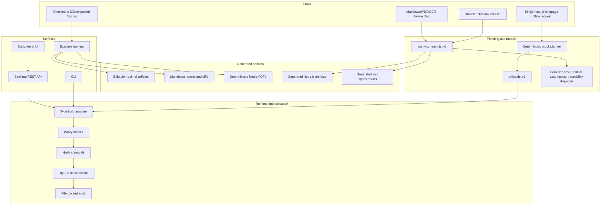
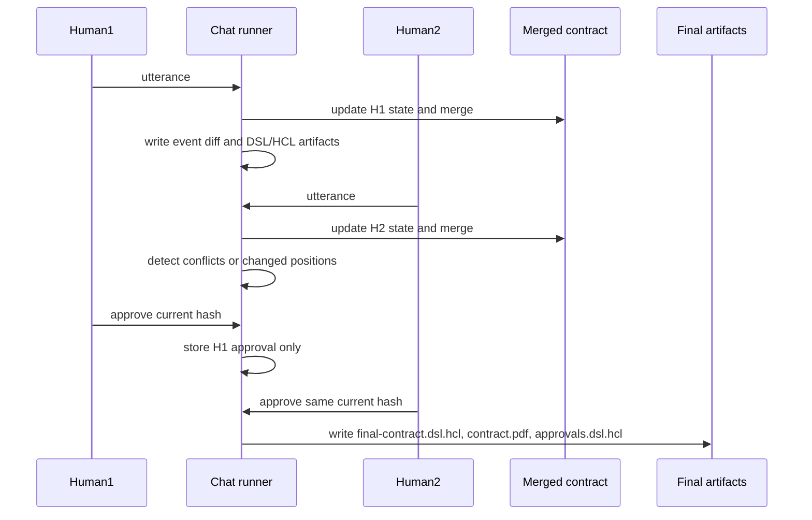
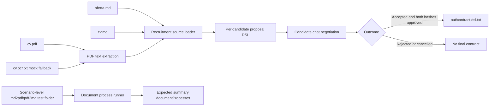
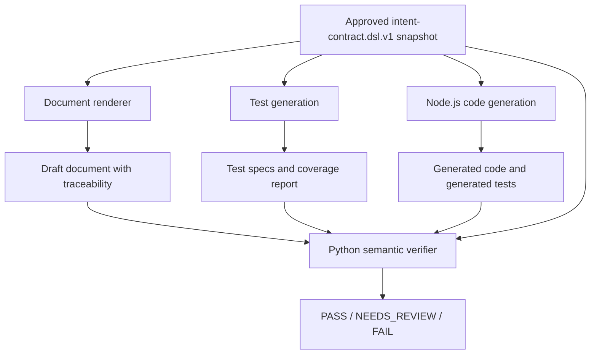
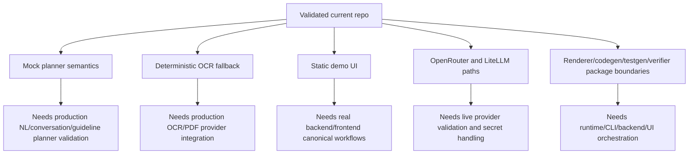

# Project Summary

This document summarizes the current DSL Runtime repository state: what has been built, how the system works, how to verify it, and what remains open. It is based on the current code, examples, tests, `TODO.md`, and generated documentation indexes.

## Executive Summary

The repository is currently an offline, examples-first DSL Runtime MVP. It started as an `office.dsl.v1` runtime for safe office actions and now also contains the package boundaries for the target Intent/Contract DSL Runtime.

The validated system can:

- turn selected natural-language office requests into `office.dsl.v1` through a deterministic mock planner,
- validate and execute office tasks in dry-run mode with policy checks, questions, confirmation, audit, CLI, backend API, and a static demo UI,
- represent canonical `intent-contract.dsl.v1` contracts with statuses, source references, stable hashing, conflicts, questions, assumptions, and approvals,
- process Human1/Human2 chat examples line by line, merge party states, show diffs, detect conflicts, invalidate stale approvals, and finalize only after both parties approve the same current hash,
- run recruitment examples with Markdown/PDF/OCR-fixture ingestion, one-process document conversion folders, per-candidate proposals, chat negotiation reuse, and accepted/rejected outcomes,
- render draft documents, generate test specifications, generate bounded JS/Node.js code, and run a Python semantic verifier at package/runtime boundaries,
- run a full local verification command through `project.sh` or `project.bat`.

The main remaining work is not another static example. The next important work is production wiring: canonical approvals, diagnosis, renderers, codegen, testgen, verifier, OCR/provider integrations, backend/UI flows, audit/event model, security policy, and release hardening.

## Current System Shape



## What Is Done

### Office DSL MVP

The current Office DSL flow is implemented and tested:

- `@office-dsl/dsl-model` defines `office.dsl.v1`, parser, validator, and readable token rendering.
- `@office-dsl/llm-planner` contains deterministic mock planning for selected office requests.
- `@office-dsl/dsl-runtime` owns sessions, state transitions, policy checks, questions, confirmation, dry-run actions, file store, and audit.
- `packages/cli` exposes planning, validation, inspection, answers, confirmation, rejection, execution, and history.
- `apps/backend` exposes REST endpoints over the same current runtime.
- `apps/web` is a static demo UI.
- `examples/` has six runnable office scenarios.

Validated by:

```powershell
.\project.bat examples
.\project.bat system-check
```

### Canonical Intent/Contract DSL

The target model exists as a package boundary:

- `@office-dsl/intent-contract-model` defines `intent-contract.dsl.v1`.
- The model includes documents, contracts, parties, roles, intents, obligations, deliverables, deadlines, payments, conditions, dependencies, acceptance criteria, exclusions, assumptions, risks, conflicts, questions, approvals, source references, rendering directives, and execution directives.
- Fields can be `CONFIRMED`, `MISSING`, `INCOMPLETE`, `AMBIGUOUS`, `CONFLICTING`, `ASSUMED`, `REJECTED`, or `NOT_APPLICABLE`.
- Canonical serialization and stable SHA-256 hashing are implemented.
- Diagnosis reports gaps, ambiguity, conflicts, unapproved assumptions, traceability gaps, and party-routed questions.
- `officeDslToIntentContractDsl` preserves compatibility with the older Office DSL path.

Validated by TypeScript model and round-trip tests.

### Human1/Human2 Chat Negotiation

`examples-chat/` contains four executable scenarios:

- `01-short-agreement`: `AGREED`
- `02-long-negotiation-agreement`: `AGREED`
- `03-short-conversation-cancelled`: `CANCELLED`
- `04-long-negotiation-cancelled`: `CANCELLED`

The runner processes each line in `chat.txt`, updates the speaking party state, merges both party contracts, writes per-line artifacts and readable diffs, detects conflicts and position changes, invalidates approvals after a contract change, and finalizes only after both parties approve the same current merged hash.



Final artifacts are created only at the event where the second party approves the same current hash. One approval alone cannot create `final-contract.dsl.hcl`, `contract.pdf`, or `approvals.dsl.hcl`. If the contract changes after approval, the earlier approval is invalidated.

Validated by:

```powershell
.\project.bat examples-chat
```

### Recruitment Examples

`examples-recruitment/` contains four executable scenarios:

- `01-multi-candidate`: one accepted candidate and one rejected candidate,
- `02-single-candidate-agreement`: one accepted candidate,
- `03-negotiated-two-candidates`: two accepted candidates,
- `04-ocr-candidate-cancelled`: one OCR-fallback candidate that cancels.

The current folder convention is scenario-level document-process folders. Each document process is one folder with one `test.json`, one `in/` side, and one `out/` side. Candidate folders remain focused on candidate input, chat, generated proposal/status/final contract output, and expected candidate result.

```text
examples-recruitment/<scenario>/
  <candidate-id>/
    in/
    out/
    chat.txt
    scenario.json
    expected/
  <process-id>-md2pdf/
    in/
    out/
    test.json
  <process-id>-pdf2md/
    in/
    out/
    test.json
  expected/
  generated/
  README.md
  scenario.json
```

Current document process fixtures:

```text
01-multi-candidate/001-anna-nowak-md2pdf/test.json
01-multi-candidate/002-anna-nowak-pdf2md/test.json
02-single-candidate-agreement/001-ewa-zielinska-md2pdf/test.json
03-negotiated-two-candidates/001-ola-maj-md2pdf/test.json
03-negotiated-two-candidates/002-jan-kot-pdf2md/test.json
04-ocr-candidate-cancelled/001-kasia-wrona-pdf2md/test.json
```



Validated by:

```powershell
.\project.bat examples-recruitment
```

### Documents, PDF, Code, Tests, And Verifier Boundaries

The following boundaries exist and are tested:

- `@office-dsl/document-renderer`: task delegation, service agreement, and employment/guideline draft renderers with traceability and explicit gaps.
- `@office-dsl/pdf-generator`: deterministic minimal PDF fixture generation and text extraction.
- `@office-dsl/testgen`: DSL-derived test-generation inputs, unit/integration/API/E2E/security/error-handling specs, and coverage verification.
- `@office-dsl/codegen`: bounded dependency-free Node ESM generation from bilaterally approved DSL snapshots, generated test execution, file hash checks, and verifier input.
- `verifier/office_dsl_verifier`: Python semantic verifier for DSL gaps, source quote checks, rendered-document mismatches, generated-code failures, uncovered test criteria, and optional LiteLLM/OpenRouter mode behind explicit configuration.



These capabilities are not yet fully exposed as production CLI/backend/UI flows. They are package-level or runtime-boundary implementations.

## How To Run And Verify

Recommended commands on Windows:

```powershell
.\project.bat makedocs
.\project.bat examples
.\project.bat examples-chat
.\project.bat examples-recruitment
.\project.bat system-check
```

Equivalent package scripts:

```powershell
corepack pnpm run docs:generate
corepack pnpm run examples:run
corepack pnpm run examples-chat:run
corepack pnpm run examples-recruitment:run
corepack pnpm run verify
```

The full `system-check` currently runs:

- TypeScript typecheck,
- ESLint,
- documentation generation,
- format check,
- documentation freshness check,
- TypeScript tests,
- Python verifier tests,
- office examples,
- chat examples,
- recruitment examples,
- whitespace diff check.

## Important Safety Rules Already Enforced

- Office execution is dry-run by default.
- Unsafe shell/dynamic-code/path traversal office requests are blocked by deterministic policy checks.
- Email sending requires explicit confirmation in the current Office DSL flow.
- Chat finalization requires bilateral approval of the same current merged hash.
- Chat cancellation never writes final contract/PDF/approval artifacts.
- Recruitment accepted candidates receive final contracts only after the reused chat flow reaches agreement.
- Generated runner DSL artifacts are project DSL/HCL text, not JSON.
- Recruitment document process folders are scenario-level one-process fixtures, not hidden inside candidate folders.

## What Is Still Partial Or Mocked



Mock or partial areas:

- Planner semantic understanding is deterministic and fixture-oriented in default verification.
- OCR is deterministic fixture/mock-safe, not production OCR for arbitrary scanned documents.
- External connectors and email delivery are mocked or dry-run.
- The current backend/web UI are MVP/demo surfaces.
- OpenRouter/LiteLLM paths exist but are not the default validated path.
- Canonical diagnosis, renderers, codegen, testgen, and semantic verifier are not yet fully wired through production user-facing flows.

## What Remains To Do

The highest-value remaining work is grouped below.

### Runtime And Approval Wiring

- Wire `diagnoseIntentContractDsl` into the live runtime/CLI/backend/UI flow.
- Expose canonical Human1/Human2 approval records through CLI/backend/UI.
- Gate rendering, codegen, testgen, and verifier orchestration on bilateral canonical approval where required.
- Populate runtime field-level source traceability from planner or scenario inputs.

### Backend And UI

- Add conversation and guideline-file input surfaces.
- Display field statuses, source references, gaps, assumptions, conflicts, and party-routed questions.
- Add visible Human1/Human2 approval and rejection flows.
- Display rendered documents with traceability.

### Production Providers

- Validate live OpenRouter planner output for arbitrary conversations and guideline files.
- Add production OCR/PDF providers behind the same deterministic interface.
- Keep offline deterministic mode as the test default.
- Add secret handling and redaction rules before enabling provider-backed flows in CI or production.

### Security, Audit, And Policy

- Define canonical security policy for LLM, runtime, renderer, codegen, verifier, and generated artifacts.
- Add a full lifecycle audit event schema.
- Add authorization for Human1/Human2 and backend/API usage.
- Add threat model and compliance review for contract/document workflows.

### Product Hardening

- Add packaging and release policy.
- Add persistence strategy beyond local files.
- Add observability and failure-mode documentation.
- Validate CI and workflows on Windows and Linux as release criteria, not only local runs.

## Current Evidence Map

| Area                     | Evidence                                                                                          |
| ------------------------ | ------------------------------------------------------------------------------------------------- |
| Office DSL model/runtime | `tests/dsl.test.ts`, `tests/runtime.test.ts`, `tests/cli.test.ts`, `tests/backend.test.ts`        |
| Security policy          | `tests/security.test.ts`                                                                          |
| Chat negotiation         | `tests/chat-runner.test.ts`, `examples-chat/*`                                                    |
| Recruitment workflow     | `tests/recruitment-runner.test.ts`, `examples-recruitment/*`                                      |
| Generated docs/readmes   | `tests/generated-docs.test.ts`, `docs/documentation-index.md`, `docs/examples-artifacts-index.md` |
| Package boundaries       | `tests/package-boundary.test.ts`                                                                  |
| NL <-> DSL               | `tests/nl-dsl-roundtrip.test.ts`                                                                  |
| Document renderers       | `tests/document-renderer.test.ts`                                                                 |
| Test generation          | `tests/testgen.test.ts`                                                                           |
| JS/Node code generation  | `tests/codegen.test.ts`                                                                           |
| Python semantic verifier | `tests/semantic-verifier.test.ts`, `verifier/tests`                                               |
| Full system              | `.\project.bat system-check` or `bash project.sh system-check`                                    |

## Recommended Next Milestone

The next stable milestone should focus on production wiring rather than adding more static examples:

1. Add runtime exposure of canonical diagnosis and approvals.
2. Add CLI/backend commands for Human1/Human2 approval, rejection, questions, and conflict inspection.
3. Gate document rendering through the canonical bilateral hash approval model.
4. Keep examples as regression evidence for every new flow.
5. Keep `system-check` as the release gate.
