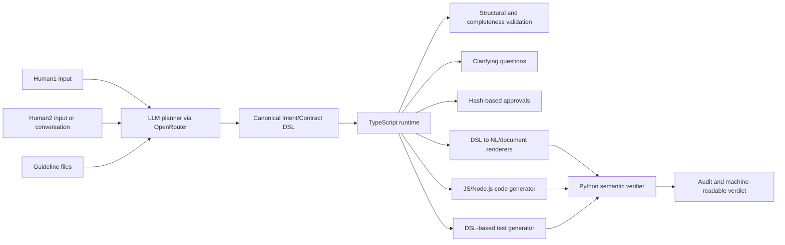
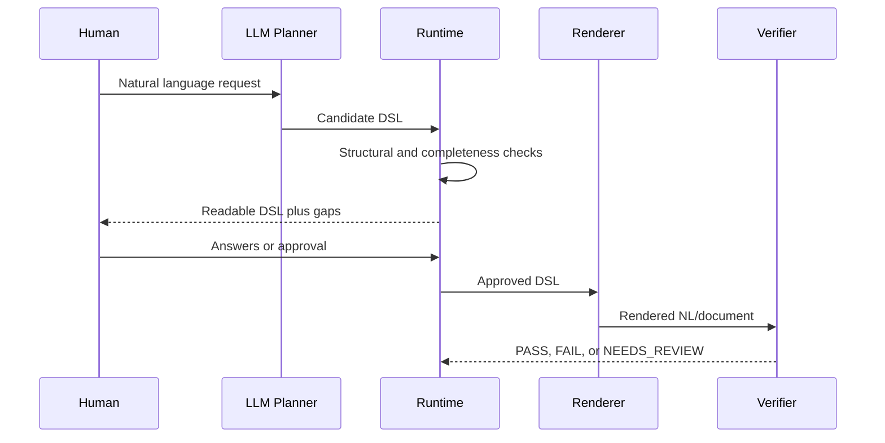
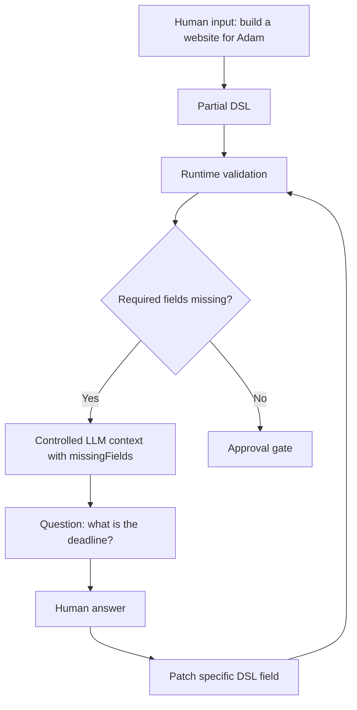
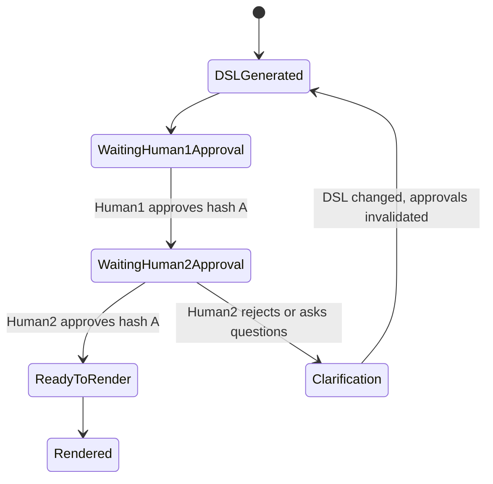
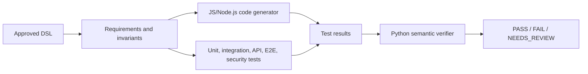

# System Purpose And Runtime Flow

## 1. Business Problem

The project is not meant to be only a small workflow language for office actions. Its long-term purpose is to formalize human intent before execution, document generation, code generation, or contract approval happens.

The problem is communication loss:

- a human writes an imprecise request,
- an LLM silently fills gaps,
- execution happens too early,
- the human discovers later that the system understood a different task.

The target system prevents this by turning natural language into an explicit, inspectable DSL. The DSL must show what is known, what is missing, what is ambiguous, what conflicts, and what was assumed.

## 2. Formalizing Intent

Formalizing intent means converting natural language, conversation history, or written guidelines into a structured representation that can be reviewed by humans and processed by machines.

The DSL is the source of truth. It should capture:

- parties and roles,
- intent and subject,
- obligations and deliverables,
- deadlines and payment,
- dependencies and exclusions,
- acceptance criteria,
- missing, ambiguous, conflicting, and assumed information,
- approvals tied to a specific DSL version,
- source references for each material field.

Current implementation status: the repository implements a narrow executable `office.dsl.v1` for office tasks, a standalone `intent-contract.dsl.v1` model package, deterministic planner adapters for selected canonical NL/conversation/guideline fixtures, and traceable DSL-to-NL summary rendering. The canonical model is still not exposed through the live CLI/backend/UI approval flows.

## 3. H2M And H2H

Human-to-Machine (H2M) starts with one human asking the system to do something, for example preparing an unpaid invoice report. The system should generate DSL, ask for missing details, show a readable representation, require confirmation when risk is high, and only then execute or generate artifacts.

Human-to-Human (H2H) starts with communication between two sides:

- Human1: requester, employer, client, or author of the intent.
- Human2: assignee, employee, contractor, or other approving party.

In H2H, Human1 approval alone is not enough. Human2 must be able to say whether the DSL is sufficient to perform the work or accept the agreement. Both sides must approve the same DSL hash. Any DSL change invalidates previous approvals.

Current implementation status: one-side Office action confirmation still exists for legacy Office DSL tasks, and the canonical Intent/Contract layer now has Human1/Human2 approval records, current-hash approval detection, approval invalidation, rejection diagnosis, and runnable chat/recruitment fixtures that prove bilateral approval behavior. Production CLI/backend/UI exposure remains open.

## 4. Target Architecture



Boundary note: the TypeScript runtime can call the Python semantic verifier through the shared verifier bridge for mock-safe semantic reports. CLI and backend still use deterministic mock verifier paths for their default Office DSL flows unless explicitly wired through the semantic verifier boundary.

## 5. Role Of The DSL

The target DSL must formalize meaning, not only workflow steps. A future canonical DSL should support constructs such as:

```text
DOCUMENT
CONTRACT
PARTY
ROLE
INTENT
SUBJECT
OBLIGATION
DELIVERABLE
DEADLINE
PAYMENT
CONDITION
DEPENDENCY
ACCEPTANCE_CRITERIA
EXCLUSION
ASSUMPTION
RISK
CONFLICT
QUESTION
APPROVAL
SOURCE_REFERENCE
RENDER
EXECUTION
```

Every important field should be able to carry a status:

```text
CONFIRMED
MISSING
INCOMPLETE
AMBIGUOUS
CONFLICTING
ASSUMED
REJECTED
NOT_APPLICABLE
```

Current implementation status: `packages/dsl-model` defines executable `office.dsl.v1` with `task`, `sources`, `steps`, `output`, `policies`, `expectedResults`, and `errorHandling`. `packages/intent-contract-model` defines standalone `intent-contract.dsl.v1` with core Intent/Contract constructs, field statuses, source references, canonical serialization, and stable hashing. The two models do not yet have an adapter.

## 6. Role Of The LLM

The target LLM planner should:

- receive controlled context,
- generate DSL conforming to the canonical schema,
- mark missing fields instead of inventing values,
- preserve source references,
- identify assumptions,
- generate questions for unresolved fields,
- support single messages, conversations, and guideline files.

Current implementation status: `packages/llm-planner` has a deterministic mock planner, deterministic mock conversion from checked-in `intent-contract.conversation.v1` fixtures to partial Intent/Contract DSL, controlled `intent-contract.planner-response.v1` schema validation for OpenRouter-style output, deterministic single-message and guideline-file Intent/Contract planning, traceable DSL-to-NL summary rendering, and an optional OpenRouter code path. The validated path is mock mode; production semantic extraction from arbitrary provider output remains outside the default verification path.

## 7. Role Of The Runtime

The runtime is the orchestrator, not only an action executor. The target runtime should:

- maintain the current DSL,
- validate structure and completeness,
- detect missing, ambiguous, conflicting, and assumed information,
- manage process states,
- request questions from the LLM,
- route questions to Human1 or Human2,
- update only the relevant DSL fragments,
- recompute the DSL hash after each change,
- invalidate approvals when the DSL changes,
- render DSL to readable summaries or formal documents,
- start code and test generation when allowed,
- call the Python verifier,
- write a complete audit trail.

Current implementation status: `packages/dsl-runtime` validates `office.dsl.v1`, builds an execution plan, applies deterministic policy checks, handles `user.ask`, handles one-side confirmation, computes a plan hash, executes mock actions, and writes audit data through the file store.

## 8. NL To DSL To NL



The target renderer must never include facts that are absent from the approved DSL.

Current implementation status: the current renderer is `renderHumanDsl`, which produces a readable tokenized representation of the office DSL. It is not a legal document renderer.

## 9. Missing Data Flow



The target runtime should ask focused questions and update specific fields. It must not let the LLM invent deadlines, prices, scope, legal terms, or acceptance criteria.

Current implementation status: missing data is represented only by `user.ask` steps in the office workflow. There is no general field-status model.

## 10. Conflict Diagnosis

Conflict diagnosis should detect when sources disagree. For example, Human1 says payment is 5000 PLN while Human2 says 7000 PLN. The DSL should represent both source references and mark the field as `CONFLICTING` until resolved.

Current implementation status: no general conflict model exists.

## 11. Human1/Human2 Approval



The target rule is simple: both required parties approve the same hash or the document is not final.

Current implementation status: the runtime stores confirmation IDs and a plan hash. It does not store party-specific approvals for a DSL hash.

## 12. Versioning, Hashes, And Traceability

Target behavior:

- DSL versions are immutable snapshots.
- Hashes are computed from canonical DSL content, not from a mutable runtime plan only.
- Approval records include party, hash, timestamp, and scope.
- Every material DSL field links to source text, speaker, message ID, file, or another traceable source.
- A DSL change invalidates approvals for older hashes.

Current implementation status: `hashPlan` hashes the execution plan. It protects confirmation against changed plans, but it is not yet a canonical DSL hash and does not model multi-party approval.

## 13. Document Generation

Target document types include:

- office command summary,
- task delegation,
- service agreement,
- employment agreement,
- contract,
- technical specification,
- implementation plan.

A final document must be generated only from approved DSL data. It should expose missing fields and conflicts instead of hiding them.

Current implementation status: `@office-dsl/document-renderer` implements deterministic draft renderers for task delegation, service agreement, and employment/guideline documents from `intent-contract.dsl.v1`. Production runtime/CLI/backend/UI gating and surface integration remain open.

## 14. Code And Test Generation



The target system should generate tests from formal DSL elements such as requirements, invariants, acceptance criteria, prohibited behavior, expected output, error handling, and security policy.

Current implementation status: `@office-dsl/codegen` implements deterministic JS/Node.js package-level generation for approved DSL inputs, and `@office-dsl/testgen` implements DSL-derived test specifications and coverage reports. Runtime/CLI/backend/UI production wiring remains open.

## 15. Python Semantic Verifier

The target verifier should compare:

- original NL,
- approved DSL,
- rendered document,
- generated code,
- generated tests,
- test results.

It should return a machine-readable verdict:

```text
PASS
FAIL
NEEDS_REVIEW
```

and include score, missing requirements, contradictions, unauthorized assumptions, uncovered acceptance criteria, code behavior mismatches, document mismatches, and recommended action.

Current implementation status: `verifier/office_dsl_verifier` provides mock-safe semantic checks plus an explicit LiteLLM/OpenRouter mode. The TypeScript side calls it through `@office-dsl/verifier-bridge`; default verification remains deterministic and offline.

## 16. Examples

Target example structure:

```text
examples/
  01-chat-to-dsl/
    in/
    out/
    conversation.md
  02-chat-history-to-service-agreement/
    in/
    out/
    conversation.md
```

Current implementation status: the repository has six office examples, four chat-negotiation examples, and one multi-candidate recruitment example. Office examples keep legacy flat fixtures and now also have `scenario.json`, `in/`, and `out/` files. Chat examples process Human1/Human2 negotiation line by line. Recruitment examples ingest checked-in `oferta.md`, `cv.md`, and `cv.pdf` fixtures, use deterministic text extraction or mock OCR fallback, generate per-candidate proposals, reuse the chat runner, and compare accepted/rejected outcomes. Generated artifacts are written beside each scenario under ignored `generated/` folders or ignored per-candidate final outputs.

## 17. End-To-End Target Scenarios

The target system should eventually support:

- single chat to DSL,
- ambiguous chat to questions,
- two-party conversation to service agreement,
- guidelines to employment agreement,
- task delegation with recipient acceptance,
- both parties approving the same hash,
- DSL rendered back to NL without meaning drift,
- code and tests generated from approved DSL,
- verifier checking consistency across all artifacts.

## 18. Component Responsibility Boundaries

Planner:
Converts input into candidate DSL and questions. It does not approve, execute, or silently finalize.

Runtime:
Owns state, validation gates, approvals, hash rules, orchestration, rendering gates, execution, and audit.

DSL model:
Defines canonical structures, field statuses, source references, and validation rules.

Verifier:
Checks semantic consistency across source, DSL, documents, code, tests, and execution results.

UI/CLI/API:
Expose the process to humans. They should not contain separate business logic that contradicts the runtime.

## 19. Current State Versus Target State

DONE:

- offline workspace and pnpm scripts,
- `office.dsl.v1` model and structural validation,
- standalone `intent-contract.dsl.v1` model with statuses, source references, and stable hashing,
- mock planner for single office commands and selected canonical NL/guideline-file fixtures,
- TypeScript runtime with simple state machine,
- deterministic policy checks,
- one-side confirmation with plan hash,
- mock data actions and dry-run execution,
- CLI, backend API, and static web demo,
- Python mock verifier package,
- static example fixtures plus runner-driven scenario manifests,
- TypeScript and Python tests for current scope.

PARTIAL:

- OpenRouter and LiteLLM paths exist but are not validated as the default flow,
- clarification exists only as workflow `user.ask`,
- package-level legal/document rendering exists, while production runtime/CLI/backend/UI wiring remains open,
- audit exists for office-task sessions, not full intent/contract lifecycle.

MOCK:

- production planner semantic understanding,
- verifier semantic judgment,
- external data and email operations,
- web UI as a demo surface.

NOT IMPLEMENTED:

- runtime population of field-level source traceability from live planner sessions,
- production CLI/backend/UI exposure for canonical approvals and document/code/test generation,
- production OCR/PDF providers beyond deterministic fixture extraction,
- live-provider planner-backed example regeneration for current stable fixtures,
- production security, auth, persistence, and CI hardening.
