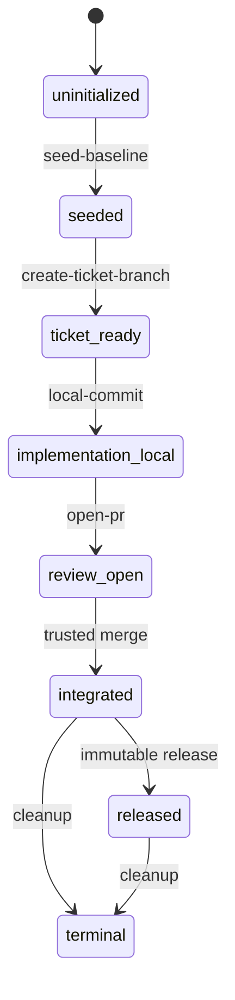

# Git lifecycle

```dsl
DOCUMENT GIT_LIFECYCLE
VERSION 2
LANGUAGE EN
MODE STRICT
SCHEMA "wellmanifest.git-lifecycle/v1"
REQUEST_GRAMMAR "git-lifecycle.v1.gbnf"
POLICY "../../POLICY.md"
```

## Responsibility

This module owns repository-state transitions. It turns a typed request into
at most one bounded Git effect and a receipt. It does not interpret product
requirements, execute model-authored commands, discover secrets, configure a
remote, or grant trusted merge authority.

It composes with [`ticket-lifecycle`](../ticket-lifecycle/README.md): the
ticket supplies bounded intent and authorization references; Git returns
receipts used by validation and closure. `POLICY.md` remains authoritative and
`CONTRIBUTING.md` is the procedural compatibility projection. A content change
increments this document's declared version; incompatible request semantics use
a new schema family rather than silently changing `/v1`.

## State machine



```dsl
STATE uninitialized
STATE seeded
STATE ticket-ready
STATE implementation-local
STATE review-open
STATE integrated
STATE released
STATE terminal

TRANSITION uninitialized -> seeded ACTION seed-baseline
TRANSITION seeded -> ticket-ready ACTION create-ticket-branch
TRANSITION ticket-ready -> implementation-local ACTION local-commit
TRANSITION implementation-local -> review-open ACTION open-pr
TRANSITION review-open -> integrated ACTION integrate
TRANSITION integrated -> released ACTION release
TRANSITION integrated -> terminal ACTION cleanup
TRANSITION released -> terminal ACTION cleanup
```

## Autonomous seed-baseline transaction

The seed transaction removes the unborn-`HEAD` dependency cycle without using
a placeholder SHA or bypassing normal implementation governance.

It is authorized only when all preconditions hold:

```dsl
AUTONOMOUS_SEED_AUTHORIZED =
  USER_REQUEST_CREATES_NEW_REPOSITORY
  AND USER_REQUEST_AUTHORIZES_EXECUTION_OR_AUTONOMOUS_MODE
  AND HEAD_STATE = unborn
  AND IMPLEMENTATION_PRESENT = false
  AND SEED_PROFILE_RESOLVES_FROM_TRUSTED_REGISTRY
  AND STAGED_PATHS = RESOLVED_SEED_PROFILE_PATHS
  AND SECRET_SCAN = PASS
  AND ADOPTION_LOCK = VALID
```

The transaction is ordered and atomic from the controller's perspective:

1. Adopt one immutable published governance revision and generate its lock.
2. Allocate the initial ticket through the managed clone-wide allocator.
3. Record ticket scope and `SESSION_EXECUTION_AUTHORIZATION` without a delivery
   base. No implementation file may exist yet.
4. Resolve a named seed profile to an exact path allowlist. Typical carriers
   are governance payload, launchers, ticket governance, repository metadata,
   pinned Docker environment and empty documentation/roadmap carriers.
5. Refuse unknown, modified-foreign or implementation paths; stage the exact
   allowlist without a wildcard.
6. Validate JSON documents, adoption provenance, secret absence, diff hygiene,
   and the invariant that neither a remote nor a product implementation exists.
7. Create exactly one local commit with reason `establish governed baseline`.
8. Read the real resulting `HEAD`, write it as `delivery.acceptedBaseSha`, and
   begin the ordinary ticket lifecycle from that immutable base.

For `account-runtime` and `saas-lifecycle`, this sequence produced real local
baselines and allowed the normal governance gate to validate later standard
files. The implementation stayed outside the baseline commit.

## Seed profile boundary

A seed profile is trusted controller configuration, not model output. It may
classify repository carriers but must resolve to concrete relative paths before
staging. It must exclude product source, generated credentials, `.env` values,
browser state, provider sessions, build output and any file not created or
classified during the current bootstrap.

```dsl
SEED_EFFECT local-commit-only
SEED_COMMIT_COUNT 1
SEED_REMOTE_EFFECTS 0
SEED_PUBLICATION_EFFECTS 0
FORBID remote-add push pull-request merge tag release force-update
FORBID wildcard-stage unknown-dirty-path implementation-path secret-material
ASSERT baseline_sha = resulting_HEAD
ASSERT implementation_diff_begins_after_baseline_sha
```

Autonomous mode is therefore a narrow commit authorization, not a broad
publication authorization. If any precondition cannot be proven, the
controller returns a rejected receipt and preserves the working tree.

## Ordinary transitions

- `create-ticket-branch` requires a clean seeded base and a ticket whose intent
  owns the branch's write scope.
- `local-commit` requires explicit user commit authority, except for the one
  seed transaction above. Staging is exact and foreign changes are preserved.
- `open-pr` requires a committed ticket branch and governed delivery tooling.
- `integrate` requires exact-head trusted approval and required checks.
- `release` originates only from a clean, retested integrated default branch.
- `cleanup` inventories every linked worktree/clone, preserves unknown data,
  and removes only an exact path proven disposable.

## Continuity and dirty work

Git state is re-observed before any continuity resume; a checkpoint cannot
move a ref, reset a tree, restore a snapshot or authorize a Git transition.
Clean work is recoverable from the exact ticket branch and `HEAD`. Dirty work
may cross a context or process boundary only when either:

1. an already-authorized `local-commit` stores the bounded material delta on
   the ticket branch; or
2. a protected controller secret-scans the delta, stores a content-addressed
   snapshot outside Git and emits an immutable artifact reference plus SHA-256.

A stash, raw patch, untracked-only delta or chat summary is not durable Git
evidence. Snapshot restoration is a separate, explicitly validated operation:
the controller first compares repository, branch, HEAD, intent/scope and status
digests. Any divergence preserves both states and routes to reconciliation;
automatic reset, overwrite or deletion is forbidden.

## Request and receipt boundary

[`git-lifecycle.schema.json`](git-lifecycle.schema.json) defines lifecycle
state, transition request and receipt variants. The request grammar emits only
the transition-request intersection in canonical key order. The controller:

1. parses GBNF output into the typed AST;
2. validates it against the closed schema;
3. resolves opaque references from trusted registries;
4. compares `expectedState` to live repository state;
5. authorizes the single declared action;
6. emits a receipt with booleans for push/publication and redaction.

A model cannot supply a branch name, path, remote coordinate, commit message,
command, credential or evidence body. Those values belong to deterministic
policy or trusted controller state.

## Invariants and failure behavior

- A seed receipt must report `pushPerformed=false` and
  `publicationPerformed=false`.
- `seeded` has a real non-null baseline SHA and no implementation.
- `integrated` is unreachable from model output alone; trusted merge evidence
  must be resolved outside the request AST.
- Every action is idempotent by `(repositoryRef, idempotencyKey)`.
- State mismatch, replay with different content, unknown reference or dirty
  foreign path rejects before an effect.
- Errors expose stable diagnostic codes and redacted evidence references only.
