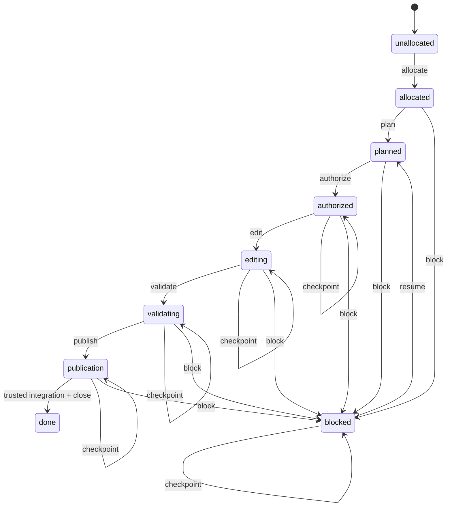

# Ticket lifecycle

```dsl
DOCUMENT TICKET_LIFECYCLE
VERSION 4
LANGUAGE EN
MODE STRICT
SCHEMA "wellmanifest.ticket-lifecycle/v1"
REQUEST_GRAMMAR "ticket-lifecycle.v1.gbnf"
POLICY "../../POLICY.md"
```

## Responsibility

This module owns the lifecycle of one bounded unit of repository work. A ticket
records the requested outcome, non-goals, exact write scope, architecture,
budgets, authorization class, evidence and workflow state. It does not grant
Git transport access, identify a human by inference, contain executable source,
or turn model prose into trusted approval.

It composes with [`git-lifecycle`](../git-lifecycle/README.md) through opaque
receipt and evidence references. `POLICY.md` remains authoritative and
`CONTRIBUTING.md` is the procedural compatibility projection. A content change
increments this document's declared version; incompatible request semantics use
a new schema family rather than silently changing `/v1`.

## State machine



```dsl
STATE unallocated
STATE allocated
STATE planned
STATE authorized
STATE editing
STATE validating
STATE publication
STATE done
STATE blocked

TRANSITION unallocated -> allocated ACTION allocate
TRANSITION allocated -> planned ACTION plan
TRANSITION planned -> authorized ACTION authorize
TRANSITION authorized -> editing ACTION edit
TRANSITION editing -> validating ACTION validate
TRANSITION validating -> publication ACTION publish
TRANSITION publication -> done ACTION close
TRANSITION ACTIVE_NONTERMINAL -> blocked ACTION block
TRANSITION blocked -> planned ACTION resume
TRANSITION [authorized, editing, validating, publication, blocked] -> SAME_STATE ACTION checkpoint
```

The lifecycle state is separate from the ticket's public status fields. The
controller projects it as follows:

| Lifecycle | Ticket status | Workflow state |
| --- | --- | --- |
| allocated, planned | BACKLOG or IN_PROGRESS | ANALYSIS or PLAN |
| authorized, editing | IN_PROGRESS | TOOLS, DELEGATION or EDIT |
| validating | IN_PROGRESS | VALIDATION |
| publication | IN_PROGRESS | PUBLICATION |
| blocked | BLOCKED | BLOCKED |
| done | DONE | DONE |

## Allocation and ownership

Ticket IDs are allocated only by the managed clone-wide allocator after
fetch/prune. The lock and high-water reservation include all linked worktrees
and known local/remote refs. A model never chooses a numeric ID or creates the
directory itself.

One implementation diff resolves to exactly one active ticket. Parallel work
uses distinct manifest workstreams, non-overlapping allowed paths and separate
worktrees. A waiting or blocked ticket releases its write reservation so it
cannot deadlock unrelated progress. A matching active ticket is reused rather
than replaced.

## Plan and bounded intent

Before implementation, the controller records:

- outcome and explicit non-goals;
- `allowedPaths` and forbidden human-participant paths;
- workstream, dependencies, conflicts and optional integration ticket;
- real `acceptedBaseSha`, target branch, file/component/interface/dependency
  budgets and accepted architecture;
- validation commands bound to acceptance criteria and evidence references.

No placeholder SHA is valid. For a new repository, `git-lifecycle` first
creates the narrow governance-only seed baseline, then the resulting real SHA
becomes `acceptedBaseSha` before the `edit` transition.

## Authorization classes

```dsl
SESSION_EXECUTION_AUTHORIZATION =
  USER_REQUEST_AUTHORIZES_EXECUTION_OR_AUTONOMOUS_MODE
  AND REQUESTED_OUTCOME_MATCHES_BOUNDED_INTENT

SEPARATE_AUTHORITY_REQUIRED =
  DESTRUCTIVE_ACTION
  OR SECRET_ACCESS
  OR NEW_EXTERNAL_COORDINATION
  OR MATERIAL_OBJECTIVE_EXPANSION

PROTECTED_DELIVERY_PROCESS_INVOCATION_AUTHORIZED =
  SESSION_EXECUTION_AUTHORIZATION
  AND REQUESTED_OUTCOME_INCLUDES_PUBLICATION
  AND PROTECTED_PROCESS_IS_DECLARED_BY_REPOSITORY_POLICY

TRUSTED_MERGE_EVIDENCE_REQUIRED =
  APPROVAL_BINDS_REPOSITORY_PR_CURRENT_HEAD_TICKET_AND_ACTOR
  AND APPROVAL_ORIGINATES_OUTSIDE_AUTHOR_CHECKOUT
  AND APPROVER_IS_ALLOWLISTED_HUMAN_OR_VALIDATOR_APP_OR_VERIFIED_ATTESTATION
```

Session authorization prevents redundant prompts inside a stable, recorded
scope. When publication belongs to that outcome, it authorizes invocation of
the declared protected delivery process and allows that process to perform its
owned merge after all exact-head gates pass. It is not a trusted review or
merge evidence, never permits the authoring agent to approve or merge directly,
and cannot replace the process-owned approval. The one autonomous seed commit
is governed by `git-lifecycle`; ordinary commits remain subject to the
publication rules.

## Validation, publication and closure

The required governance gate runs before stack tests. Validation binds the
current diff to intent scope, workstream ownership, accepted base, architecture
and budgets. LLM findings remain advisory; required verdicts are deterministic
and expose stable diagnostic codes.

An implementation ticket remains `IN_PROGRESS / PUBLICATION` while its PR is
open. Exact-head trusted review and required checks precede merge. A protected
terminal receipt records closure outside the repository; it does not trigger a
closure commit, branch or pull request. The status text remains an auditable
projection and a shared resolver releases its reservation only after receipt
bindings and Git ancestry verify. Closing an unmerged full-diff branch is
forbidden.

## Continuity checkpoint

`checkpoint` is an append-only, same-state transition for work that has an
authorization reference and may outlive the current conversation or process.
Its evidence includes exactly one bounded `new-project.work-continuity/v1`
receipt reference. The resolved checkpoint binds ticket, intent and scope
digests, HEAD, workspace digest, criteria and pending effects. It never changes
the ticket state, grants authority, renews a lease or marks an effect complete.

The controller checkpoints at material milestones, the configured time
interval, context compaction, handoff, pause, blocker and external-effect
boundaries. A dirty workspace is accepted only after an authorized branch
commit or an external content-addressed, secret-scanned snapshot. Resume first
observes live Git/PR/receipt state and revalidates the checkpoint chain,
authorization and fencing token; mismatch routes to reconciliation or blocked.

## Request and receipt boundary

[`ticket-lifecycle.schema.json`](ticket-lifecycle.schema.json) defines request,
state and receipt variants. The GBNF emits only canonical transition requests.
It uses opaque `artifact:`, `authorization:`, `decision:` and `receipt:`
references; referenced content is resolved and revalidated by the controller.

A request cannot contain user prose, source paths, shell text, secrets, review
bodies, provider payloads or arbitrary URLs. For `allocate`, the ticket is null
because the managed allocator returns it. Every later request binds the exact
ticket and intent reference.

## Invariants and failure behavior

- `(repositoryRef, idempotencyKey)` is unique; replay with changed content is
  rejected.
- `edit` requires a real accepted base and session authorization.
- `publish` cannot create trusted approval; it stops at a reviewable PR.
- A declared protected delivery process may continue from that PR through
  exact-head approval and merge without another chat confirmation when the
  recorded outcome includes publication.
- `close` requires resolved trusted integration and post-merge evidence.
- `block` preserves evidence and releases workstream/write reservations.
- `checkpoint` preserves the current state and records only a bounded external
  continuity receipt; it cannot transport conversation prose or source data.
- `resume` revalidates base, scope, dependencies and foreign workspace state.
- Every fail-closed rejection has an authority-preserving exit to retry,
  planning, blocked or a verified terminal result. Unsupported variants remain
  conservative; they never require history rewriting or destructive cleanup.
- Unknown references, state mismatch, scope overlap or missing evidence reject
  before repository mutation and yield a redacted receipt.
